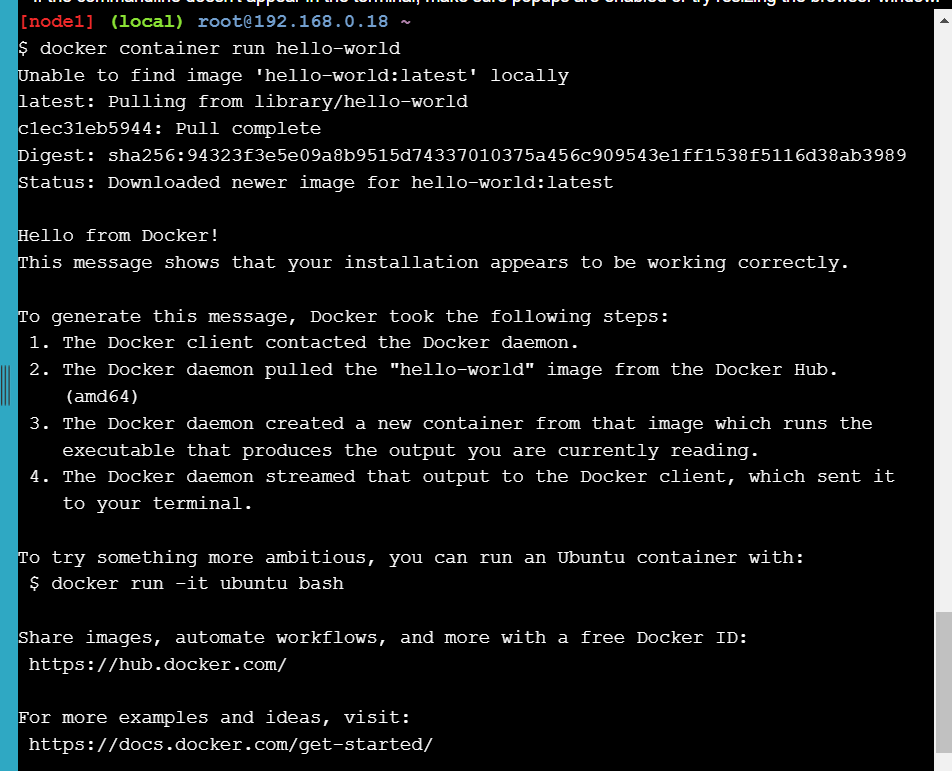

# Stage 1

Laboratorio extraido de  : 

https://training.play-with-docker.com/ops-stage1/

# Primeros contenedores Alpine Linux

---

En este laboratorio, exploraremos los siguientes conceptos básicos : 

- Docker engine
- Contenedores e imagenes
- Registros de imágenes y Docker Hub
- Aislamiento de contenedores

## 1.0 Ejecutando nuestro primer contenedor

Ejecutaremos nuestro primer contenedor con el siguiente comando : 

```powershell
docker container run hello-world
```



Explicación de la salida : 

- El Docker engine que se ejecuta en nuestra terminal intentó encontrar una **imagen** llamada **hello-world.**
- La segunda linea  `Unable to find image 'hello-world:latest' locally` nos indica que no hay imagenes almacenadas localmente.
- La linea `latest: Pulling from library/hello-world`  indica que Docker comienza a descargar la imagen **hello-world** desde Docker Hub.
- El **digest** es el hash de la imagen descargada, el cual sirve para verificar la **integridad** de la imagen .
- Finalmente muestra el mensaje  de bienvenida “Hello from Docker” , el cual confirma que Docker esta insatlado y funciona correctamente.

La siguiente imagen muestra el proceso de trabajo de Docker  cuando se ejecuta un contenedor : 


Proceso de trabajo : 

- **Comando para ejecutar el contenedor** : `docker run hello-world`.
- **Búsqueda de la Imagen Localmente**: Docker primero busca la imagen `hello-world:latest` en el sistema local.
- **Descarga desde Docker Hub**: Como la imagen no se encuentra localmente, Docker la descarga desde el registro de Docker Hub (`library/hello-world`).
- **Creación del Contenedor**: Una vez descargada la imagen, Docker crea un contenedor a partir de esta imagen.
- **Ejecución del Contenedor**: El contenedor se ejecuta y produce el mensaje "Hello from Docker!" en la terminal.

### Diferencias entre maquinas virtuales y contenedores Docker

- La máquina virtual es una abstracción *de hardware*: toma CPU físicas y RAM de un host y las divide y comparte entre varias máquinas virtuales más pequeñas. Hay un sistema operativo y una aplicación ejecutándose dentro de la máquina virtual, pero el software de virtualización generalmente no tiene conocimiento real de eso.
- Un contenedor es una abstracción *de la aplicación*: el enfoque se centra en el sistema operativo y la aplicación, y no tanto en la abstracción del hardware. En la actualidad, muchos clientes utilizan tanto máquinas virtuales como contenedores en sus entornos y, de hecho, pueden ejecutar contenedores dentro de las máquinas virtuales.

## **1.1 Imágenes de Docker**

Ejecutaremos un contenedor [Alpine Linux](http://www.alpinelinux.org/) . Alpine es una distribución Linux liviana, por lo que es rápida de instalar y ejecutar, lo que la convierte en un punto de partida popular para muchas otras imágenes.

Para comenzar, ejecutemos lo siguiente en nuestra terminal:

```
docker image pull alpine
```

El `pull`comando obtiene la **imagen** alpina del **registro de Docker** y la guarda en nuestro sistema. En este caso, el registro es **Docker Hub** .


**Explicación :**

Se indica que la imagen `alpine:latest` ha sido descargada exitosamente desde Docker Hub y ahora está disponible localmente en el sistema.

Utilizamos el comando  `docker image` para ver la lista de todas las imágenes en nuestro sistema.

```
docker image ls
```


Explicación:

- **REPOSITORY**: El nombre del repositorio al que pertenece la imagen.
- **TAG**: La etiqueta de la imagen, que en este caso es `latest` para ambas imágenes.
- **IMAGE ID**: El identificador único de la imagen.
- **CREATED**: Hace cuánto tiempo se creó la imagen.
- **SIZE**: El tamaño de la imagen.

Observamos que tenemos 2 imagenes en nuestro sistema que pertenecen a los repositorios : **alpine y hello-world** , su ID IMAGE que como vemos son diferentes ,garantizando la integridad de cada imagen.

## **1.1.1 Ejecución del contenedor Docker**

Ejecutaremos un **contenedor** Docker basado en la imagen alpine. Para ello, utilizaremos el comando :`docker container run`

```
docker container run alpine ls -l
```

Cuando 


Explicación: 

- **Encuentra la imagen**: Docker verifica si tiene la imagen `alpine` localmente.En este caso la imagen es encontrada ya que previamente ha sido descargada.
- **Crea el contenedor**: Basado en la imagen `alpine`, se crea un nuevo contenedor.
- **Ejecuta el comando**: Dentro del contenedor, se ejecuta `ls -l`.
- **Apaga el contenedor**: Una vez que el comando `ls -l` finaliza, el contenedor se apaga.

La **salida** muestra el total de bloques de 1K utilizados por todos los archivos y directorios en el directorio actual que para estas que son 8 bloques.

La primera columna muestra que **d** es un directorio con permisos de lectura(r) ,ejecución(x) y escritura (w) .

La segunda columna muestra el numero de enlaces .

La tercera columna y cuarta columna el propietario y grupo al que pertnece el directorio respectivamente.

La ultima columna muestra el tamaño , la fecha de modificación y el nombre de los directorios.

La siguiente imagen muestra el proceso que ocurre al ejecutar el comando `docker run alpine ls -l`


### **Explicación**

**Ejecución del Comando**

- El comando `docker run` se usa para crear y ejecutar un nuevo contenedor basado en la imagen `alpine`. El comando `ls -l` se pasa al contenedor para que se ejecute dentro de él.
- **Componentes**:
    - **Docker Engine**: El motor de Docker que maneja la creación y ejecución de contenedores.
    - **Linux**: El sistema operativo subyacente que ejecuta Docker.

**Ejecución dentro del Contenedor**

- Una vez que se crea el contenedor, Docker ejecuta el comando `ls -l` dentro del contenedor `alpine`. Este comando lista los archivos y directorios en el directorio raíz del contenedor con formato detallado.
- **Componentes**:
    - **Alpine Container**: El contenedor en ejecución basado en la imagen `alpine`.
    - **Alpine OS**: El sistema operativo dentro del contenedor que ejecuta el comando.

**Finalización y Salida del Comando**

- Una vez que el comando `ls -l` termina de ejecutarse, el contenedor se apaga automáticamente. La salida del comando  se envía de vuelta al terminal del sistema host.
- **Componentes**:
    - **Docker Engine**: Maneja el apagado del contenedor y la transmisión de la salida del comando al sistema host.
    - **Linux**: El sistema operativo que recibe la salida del comando.
    

Ahora ejecutamos el contenedor alpine agregando el comando `echo` : 

```
docker container run alpine echo "hello from alpine"
```


La imagen muestra que Docker creó un nuevo contenedor basado en la imagen `alpine`, ejecutó el comando `echo "hello from alpine"` y luego terminó el contenedor, todo de manera muy rápida. Esto muestra la rapidez y eficiencia de los contenedores Docker frente a las VM ,y esto se debe a la forma en que los contenedores están diseñados para operar a nivel de aplicación en lugar de a nivel de hardware.

Probaremos con otro comando.

```
docker container run alpine /bin/sh
```


A pesar de que no se muestra una salida como tal, se ha iniciado una tercera instancia del contenedor `alpine` , se ejecuto el comando `/bin/sh` y luego salio .

Docker tiene una función para agregar un shell interactivo para ello añadimos el comando `-it` , veamos : 

```
 docker container run -it alpine /bin/sh
```


La imagen a muestra que estamos dentro del contenedor ejecutando un shell de apline Linux y  probamos algunos comandos como `ls -l`, `uname -a`. 


En la primera salida muestra una lista de la estructura basica del sistema de archivos del contendor [alpine.La](http://alpine.La) segunda salida muestra  detalles sobre el kernel de Linux(`Linux 376ecbfe026f` )y la arquitectura del sistema dentro del contenedo.

Salimos del shell y del contenedor escribiendo el `exit`comando y nos dirige al sistema host :


Ejecutamos el siguiente comando para que nos muestre todos los contenedores que se están ejecutando actualmente:

```powershell
docker container ls
```


La imagen muestra que no hay ningún contenedor en ejecución.

Con el siguiente comando `docker container ls -a` veremos la lista de contenedores que hemos ejecutado : 

```
docker container ls -a
```


La imagen muestra : 

- **CONTAINER ID**:
    - El identificador único de cada contenedor.
- **IMAGE**:
    - La imagen Docker en la que se basa el contenedor en este caso son dos alpine y hello-world.
- **COMMAND**:
    - El comando que se ejecutó dentro del contenedor.
- **CREATED**:
    - Hace cuánto tiempo se creó el contenedor.
- **STATUS**:
    - El estado actual del contenedor. En este caso, todos los contenedores han terminado su ejecución (`Exited`), seguido del código de salida (`(0)` indica una salida exitosa).
- **PORTS**:
    - Los puertos expuestos por el contenedor (no se muestra ninguno en la salida).
- **NAMES**
    - El nombre asignado al contenedor.


La imagen muestra gráficamente a detalle la salida después de ejecutar el comando `docker container ls -a` :

**Container Instances :** Cada contenedor representa una instancia única basada en una imagen específica, ejecutando un comando particular, y mostrando su estado de finalización.

**Containers IDs :** Identificadores de los contendores

**Container names :** nombres de los contenedores

## **1.2 Aislamiento de contenedores**

En los pasos anteriores, ejecutamos varios comandos a través de instancias de contenedor con la ayuda de `docker container run`. El `docker container ls -a`comando nos mostró que había varios contenedores enumerados. ¿Por qué hay tantos contenedores enumerados si todos son de la imagen *alpina* ?

Este es un concepto de seguridad fundamental en el mundo de los contenedores Docker. Aunque cada `docker container run`comando utilizaba la misma ***imagen*** alpina , cada ejecución era un ***contenedor*** separado y aislado . Cada contenedor tiene un sistema de archivos independiente y se ejecuta en un espacio de nombres diferente; de manera predeterminada, un contenedor no tiene forma de interactuar con otros contenedores, incluso con aquellos de la misma imagen. Probemos con otro ejercicio para aprender más sobre el aislamiento.

```
docker container run -it alpine /bin/ash
```

Ingresamos al shell de **aplina** con el comando anterior : 


Como ya hemos ingresado al shell de alpina ahora con el comando mostrado a continuación crearemos un archivo “hello.txt” y añadiremos la cadena  **“hello world” :** 

```powershell
 echo "hello world" > hello.txt  #crea un archivo llamado “hello.txt” con las palabras “hello world” dentro
 ls 
```


Al ejecutar el comando `ls` vemos que se a añadido correctamente el archivo hello.txt ,luego salimos del shell con `exit` .


Ahora veremos como funciona el aislamiento , ejecutamos el siguiente comando : 

```
docker container run alpine ls
```


**Explicacion** : 

La imagen muestra una lista con los archivos y directorios en el directorio raíz (`/`) dentro de un contenedor basado en la imagen `alpine` como : bin ,dev, etc ,home , entre otros.

Ahora ejecutamos el siguiente comando: 

```
docker container ls -a
```


La salida muestra una lista de contenedores Docker que se han creado y ejecutado en el sistema. Cada contenedor se basa en una imagen específica, ejecutó un comando y luego terminó su ejecución.

Gráficamente esto es lo que sucedió en nuestro Docker Engine:


| Categoría | Detalles |
| --- | --- |
| Tema | Docker Container Isolation |
| Contenedor 1 | Imagen: alpine <br> Comando: ls -l <br> Estado: Exited (0) <br> Contenido: N/A |
| Contenedor 2 | Imagen: alpine <br> Comando: /bin/ash <br> Estado: Exited (0) <br> Contenido: hello.txt |
| Contenedor 3 | Imagen: alpine <br> Comando: echo <br> Estado: Exited (0) <br> Contenido: N/A |
| Contenedor 4 | Imagen: hello-world <br> Comando: hello <br> Estado: Exited (0) <br> Contenido: N/A |
| Imagen 1 | alpine |
| Imagen 2 | hello-world |
| Docker Engine | Gestiona la creación y ejecución de contenedores |
| Sistema Operativo | Linux |

Cada contenedor se ejecuta de forma aislada, utilizando su propia instancia de la imagen base.Ademas las imágenes alpine y hello-world sirven como plantillas para crear contenedores.

El contenedor en el que creamos el archivo “hello.txt” es el mismo en el que usamos el `/bin/ash`shell, que podemos ver en la columna “COMMAND”. El número *de ID de contenedor* de la primera columna identifica de forma única esa instancia de contenedor en particular. En el ejemplo de salida anterior, el ID de contenedor es `cf95e733cbf6f`. Podemos usar un comando ligeramente diferente para indicarle a Docker que ejecute esta instancia de contenedor específica. Intente escribir:

`docker container start <container ID>`

en este caso container ID es : `cf95e733cbf6f` 


La imagen muestra que se inicio el contenedor con el ID `cf95e733cbf6f`

Ahora use el `docker container ls`comando nuevamente para enumerar los contenedores en ejecución.


Vemos que ahora la instancia de contendor de la imagen alpine se esta ejecutando

Usamos el shell ash esta vez, por lo que en lugar de simplemente salir como lo hizo /bin/sh anteriormente, ash espera un comando. Podemos enviar un comando al contenedor para que se ejecute usando el `exec`comando, de la siguiente manera:

`docker container exec <container ID> ls`


Esta vez obtenemos una lista de directorios y muestra nuestro archivo “hello.txt” porque usamos la instancia de contenedor donde creamos ese archivo.

La imagen a continuacion es una representación visual de cómo usar el comando `docker container exec` para ejecutar comandos dentro de un contenedor en funcionamiento.


# **Doing More With Docker Images**

---

Comenzaremos con la forma más sencilla de creación de imágenes, en la que simplemente creamos `commit`una de nuestras instancias de contenedor como imagen. Luego exploraremos un método mucho más poderoso y útil para crear imágenes: el Dockerfile.

Luego veremos cómo obtener los detalles de una imagen a través de la inspección y exploraremos el sistema de archivos para tener una mejor comprensión de lo que sucede bajo el superficie.

## **Creación de imágenes desde un contenedor**

Primero ejecutamos un shell interactivo en un contenedor de Ubuntu, con el siguiente comando:

```
docker container run -ti ubuntu bash
```


**Explicacion :** 

En la salida muestra como se tomo la imagen llamada **“ubuntu”** de Docker Store , luego se ejecuta el shell bash dentro de ese contenedor. 

Para personalizar un poco las cosas, instalaremos un paquete llamado **[figlet](http://www.figlet.org/)** en este contenedor. El contenedor debería seguir ejecutándose, así que escriba los siguientes comandos en la línea de comandos del contenedor de Ubuntu:

-Actualiza la lista de paquetes disponibles y sus versiones.

```powershell
apt-get update 
```

Salida :  


-Instalamos  el paquete `figlet`.

```powershell
apt-get install -y figlet
```

 Finalemente generamos una representación en  ASCII del texto "hello docker" con el comando : 

```powershell
figlet "hello docker"
```

La salida  a continuación ,muestra la instalacion del paquete figlet y la frase "hola docker" impresas en caracteres ASCII grandes en la pantalla : 


Salimos del contenedor con el comando `exit` :


Ahora imaginemos que esta nueva aplicación Figlet es bastante útil y que quieres compartirla con el resto de nuestro equipo. Lo mas adecuado seria crear una *imagen* que puedas compartir con nuestro equipo.

Para comenzar, necesitamos obtener el ID de este contenedor usando el comando `ls` (no olvide la opción -a ya que el comando ls no devuelve los contenedores que no están en ejecución).

```
docker container ls -a
```


La imagen nos muestra el contendor con ID : `cb95e3150fa7` que actualmente se esta ejecutando.

Antes de crear nuestra propia imagen, es posible que queramos inspeccionar todos los cambios que hemos realizado.Para ello usamos el siguiente comando : 

```powershell
docker container diff <container ID>
```


La imagen muestra una lista de todos los archivos que se agregaron o cambiaron en el contenedor cuando instalamos figlet.Docker realiza un seguimiento de toda esta información para nosotros. Esto es parte del concepto *de capa* que exploraremos en unos minutos.

Ahora, para crear una imagen, necesitamos "confirmar" este contenedor. La confirmación crea una imagen localmente en el sistema que ejecuta el motor Docker. Ejecutamos el siguiente comando, utilizando el ID del contenedor que recuperó, para confirmar el contenedor y crear una imagen a partir de él.

`docker container commit CONTAINER_ID`


La imagen nos muestra que se ha creado una nueva imagen docker a partir del contenedor `cb95e3150fa7` y ha devuelto un hash de la nueva imagen ,lo cual indica que la creación se realizo con exito.

 ¡Hemos creadoo tu primera imagen! Una vez que la hemos enviado, podremos ver la imagen recién creada en la lista de imágenes disponibles ,usando el siguiente comando.

```
docker image ls
```

Ejecutamos en consola y nos muestra una tabla con la lista de repositorios uno de Ubuntu y otro no tiene nombre, la tag que  es como una etiqueta ,la image ID que es el identificador de cada imagen y luego el tamaño y hace cuanto tiempo ha sido creado  :


Tenga en cuenta que la imagen que extrajimos en el primer paso (ubuntu) aparece aquí junto con nuestra propia imagen personalizada. Excepto que nuestra imagen personalizada no tiene información en las columnas REPOSITORIO o ETIQUETA, lo que dificultaría identificar exactamente qué había en este contenedor si quisiéramos compartirlo entre varios miembros del equipo.

Agregar esta información a una imagen se conoce como *etiquetar* una imagen. A partir del comando anterior, obtenga el ID de la imagen recién creada y etiquétela para que se llame **ourfiglet** :

`docker image tag <IMAGE_ID> ourfiglet
docker image ls`


Ahora tenemos el nombre más amigable “ourfiglet” que podemos usar para identificar nuestra imagen : 


Aquí hay una vista gráfica de lo que acabamos de completar:


### Proceso:

1. **Inicio**:
    - **Run Ubuntu Container**:
        - Se ejecuta un contenedor basado en la imagen `ubuntu`.
        - El comando ejecutado dentro del contenedor es `apt-get install figlet`, que instala la herramienta `figlet`.
2. **Contenedor en Ejecución**:
    - **ubuntu**:
        - Muestra que el contenedor está basado en la imagen `ubuntu` y que se está ejecutando el comando para instalar `figlet`.
3. **Detener el Contenedor**:
    - **exit (stop) container**:
        - Después de que `figlet` se ha instalado, el contenedor se detiene.
4. **Contenedor Detenido**:
    - **ubuntu**:
        - El contenedor detenido contiene la instalación de `figlet`.
5. **Crear Nueva Imagen**:
    - **commit container**:
        - El contenedor detenido se usa para crear una nueva imagen Docker.
        - Se ejecuta el comando `docker commit` para crear la imagen.
    - **tag ourfiglet**:
        - La nueva imagen se etiqueta como `ourfiglet` para facilitar su identificación y uso futuro.
6. **Resultado**:
    - **ourfiglet**:
        - La nueva imagen creada contiene la instalación de `figlet` y está basada en la imagen `ubuntu`.

### Componentes del Sistema:

- **Docker Engine**:
    - Es el motor que gestiona la creación, ejecución y almacenamiento de contenedores e imágenes Docker.
- **Linux**:
    - Indica que Docker Engine se está ejecutando sobre un sistema operativo Linux.

Ahora ejecutaremos un contenedor basado en la imagen *ourfiglet* recién creada :

```
docker container run ourfiglet figlet hello
```

Como el paquete figlet está presente en nuestra imagen *ourfiglet* , el comando devuelve el siguiente resultado , el texto en ascii “hello”:


Este ejemplo muestra que podemos crear un contenedor, agregarle todas las bibliotecas y los binarios y luego confirmarlo para crear una imagen. Luego podemos usar esa imagen como lo haríamos con las imágenes extraídas de Docker Store. 

## **Creación de imágenes mediante un Dockerfile**

**En esta sección**, utilizaremos un ejemplo sencillo y crearemos una aplicación de tipo “Hola mundo” en Node.js. No te preocupes si no estás familiarizado con Node.js: Docker (y este ejercicio) no requieren que conozcas todos estos detalles.

Comenzaremos creando un archivo en el que recuperamos el nombre del host y lo mostramos. NOTA: Se debe estar en la línea de comandos del host de Docker ( `$`). Si ves una línea de comandos similar a `root@abcd1234567:/#`, probablemente todavía estés dentro del contenedor de Ubuntu del ejercicio anterior. Escribe `exit`para volver a la línea de comandos del host.

Escriba el siguiente contenido en un archivo llamado *index.js* . Puede utilizar vi, vim o varios otros editores de Linux en este ejercicio. Si necesita ayuda con los comandos del editor de Linux para realizar esta tarea, siga esta nota al pie [2](https://training.play-with-docker.com/ops-s1-images/#fn:2) .

```powershell
var os = require("os"); //Declara una variable llamada os.
var hostname = os.hostname(); //Declara una variable llamada hostname.
console.log("hello from " + hostname); //imprimirel mensjae en consola
```

Creamos el archivo con nuestro editor Vim


Completamos el archivo index.js


Verificamos que esté con el comando `cat`:


El archivo que acabamos de crear es el código javascript para nuestro servidor. Como probablemente puedas adivinar, Node.js simplemente imprimirá un mensaje de "hola". Incorporaremos esta aplicación a Docker creando un Dockerfile. Usaremos **alpine** como la imagen base del sistema operativo, agregaremos un entorno de ejecución de Node.js y luego copiaremos nuestro código fuente en el contenedor. También especificaremos el comando predeterminado que se ejecutará al crear el contenedor.

Creamos un archivo llamado *Dockerfile* y copiamos el siguiente contenido en él. Nuevamente, aquí encontrará ayuda para crear este archivo con editores de Linux [3](https://training.play-with-docker.com/ops-s1-images/#fn:3) .

```powershell
FROM alpine
RUN apk update && apk add nodejs
COPY . /app
WORKDIR /app
CMD ["node","index.js"]
```

- **`FROM alpine`**: Esta línea indica que la imagen base para este `Dockerfile` es `alpine`, que es una distribución de Linux ligera
- **`RUN apk update`**: Actualiza el índice de los repositorios de paquetes de Alpine Linux.
- **`apk add nodejs`**: Instala Node.js en la imagen. `apk` es el administrador de paquetes de Alpine Linux.
- **`COPY . /app`**: Copia todos los archivos desde el directorio actual (donde se encuentra el `Dockerfile`) al directorio `/app`
- **`WORKDIR /app`**: Establece el directorio de trabajo dentro del contenedor en `/app`. Todos los comandos subsiguientes (`RUN`, `CMD`, `ENTRYPOINT`, etc.) se ejecutarán desde este directorio.
- **`CMD ["node", "index.js"]`**: Define el comando por defecto que se ejecutará cuando se inicie un contenedor basado en esta imagen. En este caso, ejecuta `node index.js`,

De igual manera que como creamos y visualizamos`index.js` , visualizamos con `$ cat Dockerfile`:


Construyamos nuestra primera imagen a partir de este Dockerfile y llamémosla *hello:v0.1* :

```
docker image build -t hello:v0.1 .La imagen `hello:v0.1` se ha construido exitosamente a partir del `Dockerfile`, completando todas las etapas definidas en él.

```


La imagen `hello:v0.1` se ha construido exitosamente a partir del `Dockerfile`, completando todas las etapas definidas en él.

Esto es lo que acabamos de completar:


### Explicacion del Proceso:

1. **Definir la Imagen Base**:
    - La imagen base es `alpine`.
2. **Instalar Node.js**:
    - Actualiza el índice de paquetes e instala Node.js.
3. **Copiar Archivos**:
    - Copia los archivos desde el host al contenedor en el directorio `/app`.
4. **Establecer Directorio de Trabajo**:
    - Cambia el directorio de trabajo a `/app`.
5. **Definir el Comando por Defecto**:
    - Especifica que se debe ejecutar `node index.js` cuando se inicie el contenedor.

Luego iniciamos un contenedor para verificar que nuestras aplicaciones se ejecutan correctamente:

```
docker container run hello:v0.1
```

Ejecutamo el comando


**¿Qué acaba de pasar?** Creamos dos archivos: nuestro código de aplicación (index.js) es un simple fragmento de código javascript que imprime un mensaje. Y el Dockerfile son las instrucciones para que el motor Docker cree nuestro contenedor personalizado. Este Dockerfile hace lo siguiente:

1. Especifica una imagen base para extraer **desde -** la imagen `*alpina*`que usamos en laboratorios anteriores.
2. Luego **ejecuta** dos comandos (`*apk update` y `apk add`*) dentro de ese contenedor que instala el servidor Node.js.
3. Luego le indicamos que **COPIE** los archivos de nuestro directorio de trabajo al contenedor. El único archivo que tenemos ahora es nuestro  ****`*index.js` .*
4. A continuación especificamos **WORKDIR**: el directorio que debe usar el contenedor cuando se inicia.
5. Y finalmente, le dimos a nuestro contenedor un comando ( **CMD**) para ejecutar cuando el contenedor se inicia.

## **Capas de imagen**

Hay algo más interesante sobre las imágenes que creamos con Docker. Cuando se ejecutan, parecen ser un solo sistema operativo y aplicación. Pero las imágenes en sí mismas en realidad están creadas en ***capas*** . Si te desplazas hacia atrás y miras el resultado de tu `docker image build`comando, notarás que hubo 5 pasos y cada paso tenía varias tareas. Deberías ver varias tareas de "obtención" y "extracción" donde Docker está tomando varios bits de Docker Store u otros lugares. Estos bits se usaron para crear una o más *capas* de contenedor . Las capas son un concepto importante. Para explorar esto, realizaremos otro conjunto de ejercicios.

Primero, revisamos la imagen que creamos anteriormente usando el comando *history* (recuerda usar el `docker image ls`comando de ejercicios anteriores para encontrar los ID de tus imágenes):

`docker image history <image ID>`

Primero listamos las imagenes con  `docker image ls`  :


Usamos el `IMAGE ID`


Salida :Vemos la lista de imágenes de contenedores intermedios que se crearon durante el proceso de creación de la imagen final de tu aplicación Node.js. Algunas de estas imágenes intermedias se convertirán en *capas* en la imagen final del contenedor. En la salida del comando history, las capas originales de Alpine están al final de la lista y, luego, cada personalización que agregamos en nuestro Dockerfile es su propio paso en la salida. Este es un concepto poderoso porque significa que, si necesitamos hacer un cambio en nuestra aplicación, ¡puede que solo afecte a una sola capa! Para ver esto, modificaremos un poco nuestra aplicación y crearemos una nueva imagen.

Escriba lo siguiente en la ventana de su consola:

```
echo "console.log(\"this is v0.2\");" >> index.js
```

Esto agregará una nueva línea al final del archivo *index.js* de antes, de modo que su aplicación generará una línea de texto adicional. 

Lo podemos comprobar el contenido con el comando `cat index.js` :


Ahora crearemos una nueva imagen usando nuestro código actualizado. También etiquetaremos nuestra nueva imagen para marcarla como una nueva versión, de modo que cualquier persona que consuma nuestras imágenes más adelante pueda identificar la versión correcta que debe usar:

```
docker image build -t hello:v0.2 .

```


Podemos ver que los tiempos son ceros para las capas 1 y 2. **(v0.2).**
La salida indica que la imagen Docker `hello:v0.2` se construyó con éxito, aprovechando la caché para optimizar el proceso de construcción.


### Proceso de Construcción:

1. **Construcción de `hello:v0.1`**:
    - Comienza con la imagen base `alpine`.
    - Añade la capa de Node.js (`apk add nodejs`).
    - Copia el código JavaScript y establece el punto de entrada.
2. **Actualización a `hello:v0.2`**:
    - Reutiliza las capas de `alpine` y `nodejs` desde `hello:v0.1` gracias a la caché.
    - Aplica los cambios en el código JavaScript.
    - Añade una nueva capa con el cambio específico en el código (`console.log("this is v0.2");`).

### Beneficios del Uso de Caché:

- **Eficiencia**: Reutilizar capas previas reduce el tiempo de construcción porque no se reinstalan paquetes o se repiten pasos que no han cambiado.
- **Optimización**: Solo se aplican cambios incrementales, lo que optimiza el uso de recursos y acelera el proceso de construcción.

Docker reconoció que ya habíamos creado algunas de estas capas en nuestras compilaciones de imágenes anteriores y, dado que nada había cambiado en esas capas, simplemente podía usar una versión en caché de la capa, en lugar de descargar el código una segunda vez y ejecutar esos pasos. La gestión de capas de Docker es muy útil para los equipos de TI cuando se aplican parches a los sistemas, se actualiza o se mejora a la última versión del código o se realizan cambios de configuración en las aplicaciones. Docker es lo suficientemente inteligente como para crear el contenedor de la manera más eficiente posible, en lugar de crear repetidamente una imagen desde cero todas y cada una de las veces.

Tambien podemos ver las diferentes versiones creadas:


- La versión `hello:v0.2` del contenedor incluye un mensaje adicional en su salida, lo que diferencia esta versión de `hello:v0.1`.
- Este cambio refleja una modificación en el código de la aplicación dentro de la imagen `hello:v0.2`, específicamente la adición de `console.log("this is v0.2");` en el script `index.js`.

## **Inspección de imagen**

Ahora, cambiemos un poco nuestro modo de pensar. ¿Qué sucede si obtenemos un contenedor de Docker Store u otro registro y queremos saber un poco sobre lo que hay dentro del contenedor que estamos consumiendo? Docker tiene un comando **de inspección** para imágenes y devuelve detalles sobre la imagen del contenedor, los comandos que ejecuta, el sistema operativo y más.

Ejecute el siguiente comando para extraer la imagen alpine:

```
docker image pull alpine
```


Explicacion : Docker ha verificado y descargado la versión más reciente de la imagen `alpine:latest`, reutilizando las capas ya existentes en la caché local y asegurando que la imagen local esté actualizada con la versión más reciente disponible en Docker Hub.

Una vez que estemos seguros de que está allí, inspeccionémoslo.

```
docker image inspect alpine
```


Se muestra :

- Id de la imagen : "sha256:a606584aa9aa875552092ec9e1d62cb98d486f511f389609914039aadb414687”
- las capas de las que se compone la imagen
- Etiquetas de la Imagen (RepoTags)
- Digests del Repositorio (RepoDigests)
- El controlador utilizado para almacenar las capas.
- La arquitectura/sistema operativo para el que fue creado
- metadatos de la imagen como el tamaño.

 Podemos aprovechar eso para usar el comando inspect con alguna información de filtrado para obtener datos específicos de la imagen.

Obtengamos la lista de capas:

```
docker image inspect --format "{{ json .RootFS.Layers }}" alpine
```


La imagen muestra  una lista en formato JSON que contiene el identificador SHA256 de la capa de la imagen `alpine`.

Alpine es solo una pequeña imagen de sistema operativo base, por lo que solo hay una capa:

`["sha256:94e5f06ff8e3d4441dc3cd8b090ff38dc911bfa8ebdb0dc28395bc98f82f983f"]`

Ahora veamos nuestra imagen personalizada de Hola. Necesitarás el ID de la imagen (úsalo `docker image ls`si necesitas buscarlo):

Buscamos el `IMAGE ID` de `hello`: 


`docker image inspect --format "{{ json .RootFS.Layers }}" <image ID>`


Nuestra imagen de Hola es un poco más interesante (sus hashes sha256 variarán):

`["sha256:5bef08742407efd622d243692b79ba0055383bbce12900324f75e56f589aedb0","sha256:5ac283aaea742f843c869d28bbeaf5000c08685b5f7ba01431094a207b8a1df9","sha256:2ecb254be0603a2c76880be45a5c2b028f6208714aec770d49c9eff4cbc3cf25"]`

Tenemos tres capas en nuestra aplicación. Recordemos que teníamos la imagen base de Alpine (el comando FROM en nuestro Dockerfile), luego teníamos un comando RUN para instalar algunos paquetes y luego teníamos un comando COPY para agregar nuestro código javascript. ¡Esas son nuestras capas! Si observas de cerca, incluso puedes ver que tanto *Alpine* como *Hello* están usando la misma capa base, lo que sabemos porque tienen el mismo hash sha256.

---

---

# **Introducción al modo Swarm para profesionales de TI**

Para aplicaciones reales, los usuarios de TI y los equipos de aplicaciones necesitan herramientas más sofisticadas. Docker ofrece dos de esas herramientas: ***Docker Compose*** y ***Docker Swarm Mode*** . Las dos herramientas tienen algunas similitudes, pero también algunas diferencias importantes:

- **Compose** se utiliza para controlar varios contenedores en un único sistema. Al igual que el que analizamos para crear una imagen, hay un archivo de texto que describe la aplicación: qué imágenes utilizar, cuántas instancias, las conexiones de red, etc. Pero solo se ejecuta en un único sistema, por lo que, si bien es útil, omitiremos y pasaremos directamente al ***Docker Swarm Mode*** .
- **El modo Swarm** *el modo Swarm* le indica a Docker que ejecutará muchos motores Docker y que desea coordinar las operaciones entre todos ellos. El modo Swarm combina la capacidad no solo de definir la arquitectura de la aplicación, como Compose, sino también de definir y mantener altos niveles de disponibilidad, escalabilidad, equilibrio de carga y más. Con toda esta funcionalidad,se usa con más frecuencia en entornos de producción que su primo más simple, Compose.
    
    ## **La aplicación**
    
    La aplicación de votación es una aplicación multicontenedor que se suele utilizar con fines de demostración durante reuniones y conferencias de Docker. Básicamente, permite a los usuarios votar entre dos opciones, siendo las predeterminadas “gato” y “perro”, pero también podría ser “espacio” o “tabulador”, si así lo desea. Esta aplicación está disponible en Github y se actualiza con mucha frecuencia cuando se desarrollan nuevas funciones.
    
    ## **Inicializa tu Swarm**
    
    Lo primero que debemos hacer es indicar a nuestros hosts de Docker que queremos utilizar el modo Docker Swarm. Los swarm *pueden* ser de un solo nodo, pero esto es poco habitual, ya que no tendría capacidades de alta disponibilidad y limitaría gravemente su escalabilidad. La mayoría de los swarm de producción tienen al menos tres nodos *de administrador y muchos nodos de trabajo* . Tres administradores es el mínimo para tener un verdadero clúster de alta disponibilidad con quórum. 
    
    Inicializamos el modo Docker Swarm . En la primera ventana de terminal denominada [node1], ingrese lo siguiente:
    
    ```
    docker swarm init --advertise-addr $(hostname -i)
    ```
    
    Eso es todo: ahora tienes tu primer administrador de Swarm y está escuchando en la dirección IP devuelta por el comando (hostname -i). La imagen a continuacion muestra lo mencionado anteriormente:
    
    
    
    En la salida de su swarm inicial, se le proporciona un comando en el medio que se parece `docker swarm join -token SWMTKN-X-abcdef.....`al que se utiliza para unir nodos de trabajo al swarm. También se le proporciona un segundo comando `docker swarm join-token manager`para agregar administradores adicionales.
    
    Vamo a añadir un nodo de trabajo al swarm desde el segundo nodo.
    
    
    
    # **Mostrar miembros del swarm**
    
    Desde la primera ventana de terminal, verifique la cantidad de nodos en el swarm (ejecutar este comando desde el segundo nodo de trabajo de terminal fallará ya que los comandos relacionados con el swarm deben emitirse en un administrador de swarm).
    
    ```
    docker node ls
    ```
    
    Se muestra la lista de nodos actualemtne
    
    
    
    El comando anterior debería generar 2 nodos, el primero de los cuales es el administrador y el segundo, un trabajador. Debería ver que su nodo administrador también es el "líder". Esto se debe a que solo tiene un nodo administrador. El líder es exactamente lo que parece: el nodo de control principal para todos los administradores. Si su nodo líder deja de funcionar por alguna razón, los otros nodos administradores elegirán un nuevo líder; solo una de las razones por las que siempre tendría múltiples nodos administradores en una verdadera producción.
    
    Aquí se muestra una vista de los administradores y trabajadores en el modo Docker Swarm. En nuestro ejercicio, solo tenemos un administrador y un trabajador, pero puede ver cómo interactúan varios administradores y trabajadores en el diagrama:
    
    
    
    # **Clonar la aplicación de votación**
    
    Ahora, para hacer algo interesante, recuperaremos el código de la aplicación de votación de muestra de Github.
    
    Asegúrate de estar en la primera terminal (el administrador) e ingresa los dos comandos siguientes:
    
    ```
    git clone https://github.com/docker/example-voting-app
    cd example-voting-app
    ```
    
    
    
    # **Implementar una pila**
    
    Una ***pila*** es un grupo de ***servicios*** que se implementan juntos: varios componentes en contenedores de una aplicación que se ejecutan en instancias separadas. Cada *servicio* individual puede estar compuesto de uno o más contenedores, llamados ***tareas*** , y luego todas las tareas y servicios juntos conforman una *pila* .
    
    Al igual que con los archivos Dockerfiles y Compose, el archivo que define una pila es un archivo de texto sin formato que es fácil de editar y rastrear. En nuestro ejercicio, hay un archivo llamado `docker-stack.yml`en la carpeta actual que se usará para implementar la aplicación de votación como una pila. Ingrese lo siguiente para investigar el `docker-stack.yml`archivo:
    
    ```
    cat docker-stack.yml
    ```
    
    
    
    
    
    
    
    
    
    Este archivo YAML define toda nuestra pila: la arquitectura de los servicios, la cantidad de instancias, cómo se conecta todo, cómo manejar las actualizaciones de cada servicio. Es el código fuente para el diseño de nuestra aplicación. Algunos elementos de particular interés:
    
    - Cerca de la parte superior del archivo verás la línea “services:”. Estos son los componentes individuales de la aplicación. En la aplicación de votación tenemos redis, db, vote, result, worker y visualizaizer como nuestros servicios.
    - Debajo de cada servicio hay líneas que especifican cómo debe ejecutarse ese servicio:
        - ¿Recuerdas el término " *imagen*
            
            " que aparece en los laboratorios anteriores? La misma idea aquí: esta es la imagen del contenedor que se debe usar para un servicio en particular.
            
        - *Los puertoslas redes*
            
            y
            
            se explican por sí solos en su mayoría, aunque vale la pena señalar que estas redes y puertos pueden usarse de forma privada dentro de la pila o pueden permitir la comunicación externa hacia y desde una pila.
            
            [2](https://training.play-with-docker.com/ops-s1-swarm-intro/#fn-network)
            
        - Tenga en cuenta que algunos servicios tienen una línea denominada *réplicas*
            
            : esto indica la cantidad de instancias o tareas de este servicio que los administradores de Swarm deben iniciar cuando se activa la pila. El motor Docker es lo suficientemente inteligente como para equilibrar automáticamente la carga entre múltiples réplicas mediante balanceadores de carga integrados. (El balanceador de carga integrado, por supuesto, se puede reemplazar por otra cosa).
            
    
    Asegúrese de estar en la terminal del administrador [node1] y haga lo siguiente:
    
    ```
    docker stack deploy --compose-file=docker-stack.yml voting_stack
    ```
    
    
    
    Puede ver si la pila se implementó desde la terminal del administrador [node1]
    
    ```
    docker stack ls
    ```
    
    
    
    El resultado debería ser el siguiente. Indica que se han implementado los 6 servicios de la pila de la aplicación de votación (denominada voting_stack).
    
    `NAME          SERVICES
    voting_stack  6`
    
    Podemos obtener detalles de cada servicio dentro de la pila con lo siguiente:
    
    ```
    docker stack services voting_stack
    ```
    
    
    
    Si ves que no hay réplicas, espera unos segundos y vuelve a ingresar el comando. Swarm finalmente pondrá en funcionamiento todas las réplicas. Tal como `docker-stack`se especifica en nuestro archivo, hay dos réplicas del servicio *voting_stack_vote* y una de cada uno de los otros.
    
    Enumeremos las tareas del servicio electoral.
    
    ```
    docker service ps voting_stack_vote
    ```
    
    
    
    Desde la columna NODO, podemos ver que se está ejecutando una tarea en cada nodo. Esta aplicación tiene un [VISUALIZADOR DE swarm](https://training.play-with-docker.com/) integrado para mostrarte cómo está configurada y funcionando la aplicación. También puedes acceder a la [interfaz web](https://training.play-with-docker.com/) de la aplicación para emitir tu voto por perros o gatos y hacer un seguimiento de cómo van los votos en la página [de resultados](https://training.play-with-docker.com/) . Intenta abrir la interfaz varias veces para poder emitir varios votos. Deberías ver que el "ID del contenedor" que aparece en la parte inferior de la página de votación cambia, ya que tenemos dos réplicas en ejecución.
    
    El
    
    [VISUALIZADOR SWARM](https://training.play-with-docker.com/)
    
    le brinda el diseño físico de la pila, pero aquí hay una interpretación lógica de cómo se interrelacionan las pilas, los servicios y las tareas:
    
    
    
    # **Escalar una aplicación**
    
    Supongamos que nuestra votación de gatos contra perros se ha vuelto viral y nuestros dos servidores web front-end ya no pueden manejar la carga. ¿Cómo podemos indicarle a nuestra aplicación que agregue más réplicas de nuestro servicio *de votación* ? En producción, puede automatizarlo a través de las API de Docker, pero por ahora lo haremos manualmente. También puede editar el `docker-stack.yml`archivo y cambiar las especificaciones si desea que el tamaño de la escala sea más permanente. Escriba lo siguiente en la terminal [node1]:
    
    ```
    docker service scale voting_stack_vote=5
    ```
    
    
    
    Ahora, ingresa nuevamente tu `docker stack services voting_stack`comando. Deberías ver que la cantidad de réplicas para el servicio de votación aumenta a 5 y en unos segundos Swarm las tendrá todas en funcionamiento. Regresa a [la interfaz de usuario de votación de tu frontend](https://training.play-with-docker.com/) y actualiza la página varias veces. Deberías ver que el *ID del contenedor* que aparece en la parte inferior recorre los 5 contenedores. Si regresas y actualizas tu [SWARM VISUALIZER,](https://training.play-with-docker.com/) también deberías ver tu arquitectura actualizada allí.
    
    Aquí está nuestra nueva arquitectura después del escalado:
    
    
    
    A manera de conclusion ,Docker Swarm puede escalar de forma fácil y rápida los servicios de su aplicación hacia arriba y hacia abajo según lo requieran las necesidades. Nuevamente, en muchas situaciones probablemente querremos automatizar esto en lugar de escalar manualmente, lo cual es bastante fácil a través de las API de Docker.