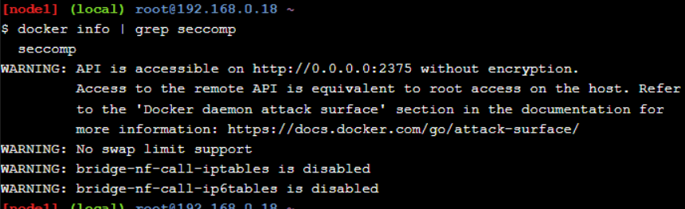

# Stage 2

# SEGURIDAD

# **Laboratorio: Seccomp**

seccomp es una función de sandboxing en el núcleo Linux que actúa como un cortafuegos para las llamadas al sistema (syscalls). Utiliza reglas de Berkeley Packet Filter (BPF) para filtrar las llamadas al sistema y controlar cómo se manejan. Estos filtros pueden limitar significativamente el acceso de un contenedor al núcleo Linux del host Docker, especialmente para contenedores/aplicaciones simples.

Pasos a seguir : 

- [Paso 1: Clonar el repositorio de GitHub de los laboratorios](https://training.play-with-docker.com/security-seccomp/#clone)
- [Paso 2: Probar un perfil seccomp](https://training.play-with-docker.com/security-seccomp/#test)
- [Paso 3: Ejecutar un contenedor sin perfil seccomp](https://training.play-with-docker.com/security-seccomp/#no-default)
- [Paso 4: eliminar llamadas al sistema de forma selectiva](https://training.play-with-docker.com/security-seccomp/#chmod)
- [Paso 5 - Escribe un perfil seccomp](https://training.play-with-docker.com/security-seccomp/#write)
- [Paso 6 - Algunos problemas](https://training.play-with-docker.com/security-seccomp/#gotchas)

## **Prerrequisitos**

Los siguientes comandos nos muestran cómo verificar si seccomp está habilitado en el kernel de su sistema:

   `$ docker info | grep seccomp`



Si la salida anterior no devuelve una línea, `seccomp`entonces nuestro sistema no tiene seccomp habilitado en su kernel.

Comprobamos desde la línea de comandos de Linux

   `$ grep SECCOMP /boot/config-$(uname -r)`


## **Seccomp y Docker**

Docker ha utilizado seccomp desde la versión 1.10 de Docker Engine.

Docker utiliza seccomp en *modo de filtro* y tiene su propio DSL basado en JSON que le permite definir *perfiles* que se compilan en filtros seccomp. Cuando ejecuta un contenedor, obtiene el perfil seccomp predeterminado a menos que lo anule al pasar el `--security-opt`indicador al `docker run`comando.

### **Paso 1: Clonar el repositorio de GitHub de los laboratorios**

En este paso, clonaremos el repositorio de GitHub del laboratorio para tener los perfiles seccomp que usará durante el resto de este laboratorio.

1. Clonaremos el repositorio de GitHub de los laboratorios.
    
    ```
    git clone https://github.com/docker/labs
    ```
    
    
    
2. Cambiamos al directorio `labs/security/seccomp`.
    
    ```
    cd labs/security/seccomp
    ```
    
    
    

Los siguientes de este laboratorio vamos a asumir que estamos ejecutando comandos desde este `labs/security/seccomp`directorio. Esto es importante al hacer referencia a los perfiles seccomp en los distintos `docker run`comandos del laboratorio.

### **Paso 2: Probar un perfil seccomp**

En este paso, usaremos el `deny.json`perfil seccomp incluido en el repositorio de guías de laboratorio. Este perfil tiene una lista blanca de llamadas al sistema vacía, lo que significa que se bloquearán todas las llamadas al sistema.

Primero agregaremos todas *las capacidades* y deshabilitaremos  *apparmor* para saber que solo su perfil seccomp está impidiendo las llamadas al sistema.

1. Usamos el comando  `docker run` para intentar iniciar un nuevo contenedor con todas las capacidades agregadas, apparmor sin restricciones y el `seccomp-profiles/deny.json`perfil seccomp aplicado.
    
    ```
    docker run --rm -it --cap-add ALL --security-opt apparmor=unconfined --security-opt seccomp=seccomp-profiles/deny.json alpine sh
    ```
    
    
    
    En la imagen podemos observar que el contenedor ha sido  correctamente iniciado.
    
2. Vamos a inspeccionar el contenido de  `seccomp-profiles/deny.json`perfil con el siguiente comando : 
    
    ```
    cat seccomp-profiles/deny.json
    ```
    
    
    
    En la salida se puede observar que no hay **llamadas al sistema** (syscalls). Esto significa que no se permitirán llamadas al sistema desde contenedores iniciados con este perfil.
    

En este paso, eliminé las interferencias de *las capacidades* y *de la protección de aplicaciones* , y comenzamos con un nuevo contenedor con un perfil seccomp que no tenía llamadas al sistema en su lista blanca. Observaste cómo esto impidió todas las llamadas al sistema desde dentro del contenedor o permitió que se iniciara en primer lugar.

### **Paso 3: Ejecutar un contenedor sin perfil seccomp**

A menos que especifique un perfil diferente, Docker aplicará el [perfil seccomp predeterminado](https://github.com/docker/docker/blob/master/profiles/seccomp/default.json) a todos los contenedores nuevos. En este paso, aplicaré cómo forzar la ejecución de un contenedor nuevo sin un perfil seccomp.

1. Inicio un nuevo contenedor con la `-security-opt seccomp=unconfined`bandera para que no se le aplique ningún perfil seccomp.
    
    ```
    docker run --rm -it --security-opt seccomp=unconfined debian:jessie sh
    ```
    
    
    
2. Desde la terminal del contenedor, ejecuté un `whoami`comando para confirmar que el contenedor funciona y puede realizar llamadas al sistema al host Docker.
    
    ```
    whoami
    ```
    
    
    
3. Para demostrar que no estamos ejecutando el perfil seccomp predeterminado, ejectué un `unshare`  con el siguotene comando:
    
    ```
      unshare --map-root-user --user
      whoami
    ```
    
    
    
4. Salgo del nuevo shell y del contenedor con el comando `exit`


1. Ejecutamos el siguiente `strace`comando desde su host Docker para ver una lista de las llamadas al sistema utilizadas por el `whoami`programa.
    
    Su host Docker necesitará tener el `strace`paquete instalado.
    
    ```
    apk add --update strace //actualizar los paquetes
    ```
    
    
    
    ```powershell
    strace -c -f -S name whoami 2>&1 1>/dev/null | tail -n +3 | head -n -2 | awk '{print $(NF)}'
    ```
    
    
    

Tambien con el comando `strace whoami ,` comando mas simple podemos obetener una salida mas detallada : 


Podemos sustituir **whoami** por cualquier otro programa.

Resumen : 

En este paso, inicie un nuevo contenedor sin perfil seccomp y verifiqué que el `whoami`programa pudiera ejecutarse. Además utilicé el `strace`programa para enumerar las llamadas al sistema realizadas por una ejecución particular del `whoami`programa.

### **Paso 4: eliminar llamadas al sistema de forma selectiva**

En este paso, vamos a ver cómo aplicar cambios al `default.json`perfil puede ser una buena forma de ajustar qué llamadas al sistema están disponibles para los contenedores.

- El `default-no-chmod.json`perfil es una modificación del `default.json`perfil con las llamadas al sistema `chmod()`, `fchmod()`, y `chmodat()`eliminadas de su lista blanca.
1. Inicié un nuevo contenedor con el `default-no-chmod.json`perfil e intente ejecuto los sgts comandos :
    
    ```
    docker run --rm -it --security-opt seccomp=./seccomp-profiles/default-no-chmod.json alpine sh
    ```
    
    
    
    y luego desde el interior del contenedor:
    
    ```
    chmod 777 / -v
    ```
    
    
    

El comando **falla** porque `chmod 777 / -v`utiliza algunas de las llamadas al sistema `chmod()`, `fchmod()`y `chmodat()`que se han eliminado de la lista blanca del `default-no-chmod.json`perfil.

1. Salimos del contenedor con `exit`.
2. Inicio otro contenedor nuevo con el `default.json`perfil y ejecute el mismo `chmod 777 / -v`.
    
    ```
    docker run --rm -it --security-opt seccomp=./seccomp-profiles/default.json alpine sh
    ```
    
    salida :
    
    
    
    y luego desde el interior del contenedor:
    
    ```
    chmod 777 / -v
    ```
    
    
    
    `mode of '/' changed to 0777 (rwxrwxrwx)`
    

El comando tiene **éxito** esta vez porque el `default.json`perfil tiene las llamadas al sistema `chmod()`, `fchmod()`, y `chmodat`incluidas en su lista blanca.

1. Salimos del contenedor.
    
    ```
    exit
    ```
    
2. Verifico que  ambos perfiles para detectar la presencia de las llamadas al sistema `chmod()`, `fchmod()`y `chmodat()`   con el siguiente comando : 
    
    ```
    cat ./seccomp-profiles/default.json | grep chmod
    ```
    
    
    
    El resultado de la imagen  muestra que el `default-no-chmod.json`perfil no contiene llamadas al sistema relacionadas con **chmod** en la lista blanca.
    

Resumen : 

En este paso, se vio cómo eliminar llamadas al sistema específicas del `default.json`perfil puede ser una forma poderosa de comenzar a ajustar la seguridad de sus contenedores.

### **Paso 5: Escribe un perfil seccomp**

 En este paso,veremos acerca de la sintaxis y el comportamiento de los perfiles de seccomp de Docker.

La estructura de un perfil seccomp de Docker es la siguiente:

```json
{
    "defaultAction": "SCMP_ACT_ERRNO",
    "architectures": [
        "SCMP_ARCH_X86_64",
        "SCMP_ARCH_X86",
        "SCMP_ARCH_X32"
    ],
    "syscalls": [
        {
            "name": "accept",
            "action": "SCMP_ACT_ALLOW",
            "args": []
        },
        {
            "name": "accept4",
            "action": "SCMP_ACT_ALLOW",
            "args": []
        }
    ]
}
```

La fuente más confiable sobre cómo escribir perfiles seccomp de Docker son las estructuras utilizadas para deserializar JSON.

- docker/engine-api : [https://github.com/docker/engine-api/blob/c15549e10366236b069e50ef26562fb24f5911d4/types/seccomp.go](https://github.com/docker/engine-api/blob/c15549e10366236b069e50ef26562fb24f5911d4/types/seccomp.go)
- opencontainers/runtime-spec: [https://github.com/opencontainers/runtime-spec/blob/6be516e2237a6dd377408e455ac8b41faf48bdf6/specs-go/config.go#L502](https://github.com/opencontainers/runtime-spec/blob/6be516e2237a6dd377408e455ac8b41faf48bdf6/specs-go/config.go#L502)

En la tabla mostrada se enumeran las posibles *acciones* en orden de precedencia. Las acciones de mayor jerarquía prevalecen sobre las de menor jerarquía.

| Acción | Descripción |
| --- | --- |
| SCMP_ACT_KILL | Matar con un estado de salida de0x80 + 31 (SIGSYS) = 159 |
| Trampa SCMP_ACT | Enviar una SIGSYSseñal sin ejecutar la llamada al sistema |
| Error SCMP_ACT_ERRNO | Establecer errnosin ejecutar la llamada del sistema |
| Seguimiento de acciones de SCMP | Invocar un ptracer para tomar una decisión o errnoestablecerla-ENOSYS |
| SCMP_ACT_PERMITIR | Permitir |

Las acciones más importantes para los usuarios de Docker son `SCMP_ACT_ERRNO`y `SCMP_ACT_ALLOW`.

Los perfiles pueden contener filtros más granulares basados en el valor de los argumentos de la llamada del sistema.

```powershell
{
   
    "syscalls": [
        {
            "name": "accept",
            "action": "SCMP_ACT_ALLOW",
            "args": [
                {
                    "index": 0,
                    "op": "SCMP_CMP_MASKED_EQ",
                    "value": 2080505856,
                    "valueTwo": 0
                }
            ]
        }
    ]
}
```

- `index`
    
    es el índice del argumento de llamada del sistema
    
- `op`
    
    es la operación que se debe realizar sobre el argumento. Puede ser una de las siguientes:
    
    - SCMP_CMP_NE - no es igual
    - SCMP_CMP_LT - menos de
    - SCMP_CMP_LE - menor o igual a
    - SCMP_CMP_EQ - igual a
    - SCMP_CMP_GE - mayor o igual a
    - SCMP_CMP_GT - mayor que
    - SCMP_CMP_MASKED_EQ - enmascarado igual: verdadero si`(value & arg == valueTwo)`
- `value`
    
    es un parámetro para la operación
    
- `valueTwo`
    
    se utiliza únicamente para SCMP_CMP_MASKED_EQ
    

La regla solo coincide si **todos** los argumentos coinciden. Agregar varias reglas para lograr el efecto de un OR.

`strace`se puede utilizar para obtener una lista de todas las llamadas al sistema realizadas por un programa. Es un muy buen punto de partida para escribir políticas de seccomp. 

Con el siguiente comando podemos enumerar todas las llamadas al sistema realizadas por `ls`:

```
strace -c -f -S name ls 2>&1 1>/dev/null | tail -n +3 | head -n -2 | awk '{print $(NF)}'

```


El resultado anterior muestra las llamadas al sistema que deberán habilitarse para que un contenedor que ejecute el `ls`programa funcione, además de las llamadas al sistema necesarias para iniciar un contenedor.

En este paso, aprendió el formato y la sintaxis de los perfiles seccomp de Docker. También aprendió el orden de preferencia de las acciones, así como también cómo determinar las llamadas al sistema que necesita un programa individual.

---

---

---

---

---

---

## **Sección 2 del stage 2: Capacidades del kernel de Linux y Docker**

En este laboratorio aprenderé los conceptos básicos de las capacidades en el kernel de Linux. Exploraré cómo funcionan con Docker, aprenderé comandos básicos para ver y gestionarlas, y también cómo añadir y quitar capacidades en nuevos contenedores.

### **Paso 1: Introducción a las capacidades**

En este paso aprenderé los **fundamentos de las capacidades en Linux**. El kernel de Linux divide los privilegios del usuario root en unidades distintas llamadas capacidades. Por ejemplo, la capacidad CAP_CHOWN permite al usuario root realizar cambios arbitrarios en los UID y GID de los archivos, mientras que CAP_DAC_OVERRIDE le permite ignorar las comprobaciones de permisos del kernel en operaciones de lectura, escritura y ejecución de archivos. Esta descomposición permite eliminar capacidades individuales de la cuenta de root, disminuyendo su poder, y añadir privilegios a usuarios no root de manera granular. Las capacidades se aplican tanto a archivos como a hilos, permitiendo ejecutar programas con mayor nivel de privilegios y controlando el estado actual de las capacidades en los programas en ejecución mediante conjuntos de límites de capacidades que Docker establece antes de iniciar un contenedor, eliminando casi todas las capacidades por defecto excepto las necesarias.

### **Paso 2: Trabajar con Docker y capacidades**

Aprenderemos el enfoque básico para gestionar capacidades con Docker. También conoceré los comandos de Docker utilizados para gestionar las capacidades de la cuenta root de un contenedor.

A partir de Docker 1.12, tienes tres opciones principales para el uso de capacidades:

1. Ejecutar contenedores como root con un conjunto amplio de capacidades e intentar gestionarlas manualmente dentro del contenedor.
2. Ejecutar contenedores como root con capacidades limitadas y nunca cambiarlas dentro del contenedor.
3. Ejecutar contenedores como un usuario no privilegiado sin capacidades.

En los comandos siguientes, se utilizará `$CAP` para indicar una o más capacidades individuales.

Para eliminar capacidades de la cuenta root de un contenedor:

```bash
docker run --rm -it --cap-drop $CAP alpine sh
```

Para añadir capacidades a la cuenta root de un contenedor:

```bash
docker run --rm -it --cap-add $CAP alpine sh
```

Para eliminar todas las capacidades y luego añadir explícitamente capacidades individuales a la cuenta root de un contenedor:

```bash
docker run --rm -it --cap-drop ALL --cap-add $CAP alpine sh
```

### **Paso 3: Probando las capacidades de Docker**

El kernel de Linux prefija todas las constantes de capacidades con "CAP_". Por ejemplo, CAP_CHOWN, CAP_NET_ADMIN, CAP_SETUID, CAP_SYSADMIN, etc. Las constantes de capacidades de Docker no están prefijadas con "CAP_", pero de otra manera coinciden con las constantes del kernel.

1. **Cambio de propiedad de archivos**: Iniciamos un nuevo contenedor y verificamos que la cuenta root del contenedor puede cambiar la propiedad de archivos usando la capacidad CAP_CHOWN.
    
    ```bash
    docker run --rm -it alpine chown nobody /
    ```
    
    
    
    
    
    Explicaicion : El comando no devuelve un código de retorno, lo que indica que la operación fue exitosa debido a que los nuevos contenedores se inician con un usuario root y este usuario tiene la capacidad CAP_CHOWN de forma predeterminada.
    
2. **Eliminación y adición de capacidades**: Inicia otro nuevo contenedor y elimina todas las capacidades excepto CAP_CHOWN para la cuenta root del contenedor. Recuerda que Docker no utiliza el prefijo "CAP_" al dirigirse a las constantes de capacidad.
    
    ```bash
    docker run --rm -it --cap-drop ALL --cap-add CHOWN alpine chown nobody /
    ```
    
    
    
    
    
    Este comando tampoco devuelve un código de retorno, indicando un funcionamiento exitoso. Aunque todas las capacidades fueron eliminadas para la cuenta root del contenedor, se añadió la capacidad `chown` nuevamente, lo que es suficiente para cambiar la propiedad de un archivo.
    
3. **Eliminación específica de capacidad**: Inicia otro nuevo contenedor y elimina solo la capacidad `CHOWN` de la cuenta root.
    
    ```bash
    docker run --rm -it --cap-drop CHOWN alpine chown nobody /
    ```
    
    
    
    
    
    Esta vez, el comando devuelve un código de error, indicando que falló. Esto se debe a que la cuenta root del contenedor no tiene la capacidad `CHOWN` y por lo tanto no puede cambiar la propiedad de un archivo o directorio.
    
4. **Agregar capacidades a usuarios no root**: Crea otro nuevo contenedor e intenta agregar la capacidad `CHOWN` al usuario no root llamado `nobody`. En el mismo comando, intenta cambiar la propiedad de un archivo o directorio.
    
    ```bash
    docker run --rm -it --cap-add CHOWN -u nobody alpine chown nobody /
    ```
    
    
    
    
    
    El comando anterior falla porque Docker actualmente no admite agregar capacidades a usuarios no root.
    

### **Paso 4: Extra para expertos**

El resto de este laboratorio muestra herramientas adicionales para trabajar con capacidades desde la shell de Linux.

Hay dos conjuntos principales de herramientas para gestionar capacidades:

**libcap** se enfoca en la manipulación de capacidades. **libcap-ng** tiene algunas herramientas útiles para auditoría.

**libcap**

- **capsh**: permite realizar pruebas de capacidades y depuración limitada.
- **setcap**: establece bits de capacidad en un archivo.
- **getcap**: obtiene los bits de capacidad de un archivo.

**libcap-ng**

- **pscap**: lista las capacidades de los procesos en ejecución.
- **filecap**: lista las capacidades de los archivos.
- **captest**: prueba las capacidades y lista las capacidades para el proceso actual.

**Listado de todas las capacidades** El siguiente comando iniciará un nuevo contenedor utilizando Alpine Linux, instalará el paquete `libcap` y luego listarán las capacidades (ver imagen ).

```bash
docker run --rm -it alpine sh -c 'apk add -U libcap; capsh --print'
```


Aquí está el texto corregido y ajustado:


**Experimentando con capacidades** El comando `capsh` puede ser útil para experimentar con capacidades. `capsh --help` muestra cómo usar el comando:

```bash
docker run --rm -it alpine sh -c 'apk add -U libcap; capsh --help'

```


### **Modificación de capacidades**

Tanto `libcap` como `libcap-ng` ofrecen opciones para modificar las capacidades de los archivos.

Para utilizar `libcap` y modificar las capacidades en un archivo, puedo usar el siguiente comando. Por ejemplo, para establecer la capacidad `CAP_NET_RAW` como efectiva y permitida en el archivo especificado por `$file`, se emplea el comando `setcap` de `libcap`.

```bash
setcap cap_net_raw=ep $file
```

Si prefiero utilizar `libcap-ng`, puedo recurrir al comando `filecap`.

```bash
filecap /ruta/absoluta net_raw
```

Es importante tener en cuenta que `filecap` requiere nombres de ruta absolutos, sin admitir atajos como `./`.

### **Auditoría**

Existen varias formas de verificar las capacidades de un archivo.

Usando `libcap`, puedo obtener las capacidades de un archivo con el comando `getcap`.

```bash
getcap $file

$file = cap_net_raw+ep

```

Con `libcap-ng`, también puedo listar las capacidades de un archivo con el comando `filecap`.

```bash
filecap /ruta/absoluta/al/archivo

```

Además, los atributos extendidos (paquete `attr`) proporcionan otra opción para obtener información detallada sobre las capacidades de un archivo.

```bash
getfattr -n security.capability $file
# file: $file
security.capability=0sAQAAAgAgAAAAAAAAAAAAAAAAAAA=

```

Estas herramientas son útiles para modificar y auditar las capacidades de los archivos en sistemas Linux utilizando `libcap` y `libcap-ng`.

# REDES

---

—

# **Laboratorio práctico sobre redes Docker**

En este laboratorio, aprenderemos sobre conceptos clave de redes Docker. Se pondrá manos a la obra revisando ejemplos de algunos conceptos básicos de redes, aprenderá sobre redes Bridge y, por último, sobre redes Overlay.

> Tareas :
> 
> - [Sección n.° 1: Conceptos básicos de redes](https://training.play-with-docker.com/docker-networking-hol/#task1)
> - [Sección n.° 2: Redes de bridges](https://training.play-with-docker.com/docker-networking-hol/#task2)
> - [Sección n.° 3: Redes superpuestas](https://training.play-with-docker.com/docker-networking-hol/#task3)
> - [Limpiar](https://training.play-with-docker.com/docker-networking-hol/#cleanup)

## **Sección n.° 1: Conceptos básicos de redes**

### **Paso 1: El comando Docker Network**

El `docker network`comando es el comando principal para configurar y administrar redes de contenedores. Ejecute el `docker network`comando desde la primera terminal.

```
docker network
```


El resultado del comando muestra cómo utilizar el comando y todos los `docker network`subcomandos. Como puede ver en el resultado, el `docker network`comando le permite crear nuevas redes, enumerar redes existentes, inspeccionar redes y eliminar redes. También le permite conectar y desconectar contenedores de las redes.

### **Paso 2: Enumere las redes**

Ejecute un `docker network ls`comando para ver las redes de contenedores existentes en el host Docker actual.

```
docker network ls
```


La salida anterior muestra las redes de contenedores que se crean como parte de una instalación estándar de Docker.

Las nuevas redes que cree también aparecerán en la salida del `docker network ls`comando.

Podemos observar que cada red obtiene un `ID`y único `NAME`. Cada red también está asociada con un solo controlador. Observe que la red "bridge" y la red "host" tienen el mismo nombre que sus respectivos controladores.

### **Paso 3: Inspeccionar una red**

El comando `docker network inspect` se usa para ver los detalles de configuración de la red. Estos detalles incluyen: nombre, ID, controlador, controlador IPAM, información de subred, contenedores conectados y más.

El siguiente comando , podremos ver los detalles de configuración de las redes de contenedores en mi host Docker. El comando muestra los detalles de la red llamada `bridge`.

```
docker network inspect bridge
```


> NOTA: La sintaxis del docker network inspectcomando es docker network inspect <network>, donde <network>puede ser el nombre de la red o el ID de la red. En el ejemplo anterior, mostramos los detalles de configuración de la red denominada “bridge”. No lo confunda con el controlador “bridge”.
> 

### **Paso 4: Enumerar los complementos del controlador de red**

Ejecutamos el comando `docker info` y luego hallamos la lista de complementos de red.

```
docker info
```


La salida anterior muestra los controladores de **bridge** , **host** , **macvlan** , **null** y **superposición .**

## **Sección n.° 2: Redes de bridges**

### **Paso 1: Los conceptos básicos**

Cada instalación limpia de Docker viene con una red preconstruida llamada **bridge** . Verifíquelo con `docker network ls`.

```
docker network ls
```


Explicacion : 

- Se observa  que la red ”bridge” está asociada con el controlador(driver) *de “bridge”* . Es importante tener en cuenta que la red y el controlador están conectados, pero no son lo mismo. En este ejemplo, la red y el controlador tienen el mismo nombre, sin embargo no son lo mismo.
- muestra que la red **de bridge** tiene un alcance local. Esto significa que la red solo existe en este host de Docker. Esto es así para todas las redes que utilizan el controlador *de bridge : el controlador de bridge* proporciona redes de un solo host.
- Todas las redes creadas con el controlador *de bridge* se basan en un *bridge* Linux (también conocido como un **conmutador virtual**).

Instala el `brctl`comando y úsalo para enumerar los bridges Linux en tu host Docker. Puedes hacerlo ejecutando `sudo apt-get install bridge-utils`.

```
apk update
apk add bridge
```


Luego, enumeré los bridges en tu host Docker ejecutando `brctl show`.

```
brctl show
```


El resultado anterior muestra un único bridge Linux llamado **docker0** . Este es el bridge que se creó automáticamente para la red bridge . Puedes ver que actualmente no tiene interfaces conectadas a él.

También puede utilizar el `ip a`comando para ver los detalles del bridge **docker0** .

```
ip a
```


### **Paso 2: Conectar un contenedor**

La red **bridge** es la red predeterminada para los contenedores nuevos. Esto significa que, a menos que especifique una red diferente, todos los contenedores nuevos se conectarán a la red **bridge** .

Cree un nuevo contenedor ejecutando `docker run -dt ubuntu sleep infinity`.

```
docker run -dt ubuntu sleep infinity
```


Este comando creará un nuevo contenedor basado en la `ubuntu:latest`imagen y ejecutará el `sleep`comando para mantener el contenedor en ejecución en segundo plano.

Ejecutamos el siguiente comando para ver el estado de ejecucion:

```
docker ps
```


Vemos que nuestro contedor se esta ejecuentando y esta activo.

Como no se especificó ninguna red en el `docker run`comando, el contenedor se agregará a la red **del bridge** .

Ejecute el `brctl show`comando nuevamente.

```
brctl show
```


Vemo que ahora  el bridge **docker0**  tiene una interfaz conectada. Esta interfaz conecta el bridge **docker0** al nuevo contenedor que acaba de crear.

Inspeccionamos la red **del bridge** nuevamente, ejecutando `docker network inspect bridge`, para ver el nuevo contenedor adjunto a ella.

```
docker network inspect bridge
```


### **Paso 3: Probar la conectividad de la red**

La salida del `docker network inspect`comando anterior muestra la dirección IP del nuevo contenedor. En el ejemplo anterior es “172.17.0.2”, pero la tuya puede ser diferente.

Haga ping a la dirección IP del contenedor desde el indicador de shell de su host Docker ejecutando `ping -c5 <IPv4 Address>`. 

Direccion IP : `172.17.0.2`

```powershell
ping -c5 172.17.0.2
```


**EXPLICACION** : Las respuestas anteriores muestran que el host de Docker puede hacer ping al contenedor a través de la red **de bridge** . Pero también podemos verificar que el contenedor también pueda conectarse al mundo exterior. Inicie sesión en el contenedor, instale el `ping`programa y luego haga ping `www.github.com`.

Primero, necesitamos obtener el ID del contenedor que iniciamos en el paso anterior. Puedes ejecutarlo `docker ps`para obtenerlo.

```
docker ps
```


Nos muestra el id : `c3a420d0dc73`

A continuación, ejecutemos un shell dentro de ese contenedor de Ubuntu, ejecutando `docker exec -it <CONTAINER ID> /bin/bash`.

```powershell
docker exec -it yourcontainerid /bin/bash
```


A continuación, tenemos que instalar el programa ping. Ejecutémoslo `apt-get update && apt-get install -y iputils-ping`.

```
apt-get update && apt-get install -y iputils-ping
```


Hagamos ping a www.github.com ejecutando`ping -c5 www.github.com`

```
  ping -c5 www.github.com
```


Por último, desconectemos nuestro shell del contenedor, ejecutando `exit`.

```
exit
```


También deberíamos detener este contenedor para limpiar los errores de esta prueba ejecutando `docker stop <CONTAINER ID>`.

`docker stop yourcontainerid`

Esto demuestra que el nuevo contenedor puede hacer ping a Internet y, por lo tanto, tiene una configuración de red válida y funcional.

### **Paso 4: Configurar NAT para conectividad externa**

En este paso, iniciaré un nuevo contenedor **NGINX** y asignaremos el puerto 8080 en el host Docker al puerto 80 dentro del contenedor. Esto significa que el tráfico que llega al host Docker en el puerto 8080 se transferirá al puerto 80 dentro del contenedor.

> NOTA: Si iniciamos un nuevo contenedor desde la imagen oficial NGINX sin especificar un comando para ejecutar, el contenedor ejecutará un servidor web básico en el puerto 80.
> 

Inicie un nuevo contenedor basado en la imagen oficial NGINX ejecutando `docker run --name web1 -d -p 8080:80 nginx`.

```
docker run --name web1 -d -p 8080:80 nginx
```


La imagen muestra que se ha iniciado el nuevo contendor.

Revise el estado del contenedor y las asignaciones de puertos ejecutando `docker ps`.

```
docker ps
```


La línea superior muestra el nuevo contenedor **web1** que ejecuta NGINX. Tome nota del comando que está ejecutando el contenedor, así como de la asignación de puertos: `0.0.0.0:8080->80/tcp`asigna el puerto 8080 en todas las interfaces del host al puerto 80 dentro del contenedor **web1** . Esta asignación de puertos es lo que hace que el servicio web de los contenedores sea accesible desde fuentes externas (a través de la dirección IP de los hosts de Docker en el puerto 8080).

Ahora que el contenedor está ejecutándose y asignado a un puerto en una interfaz de host, puede probar la conectividad al servidor web NGINX.

Para completar esta tarea, necesito la dirección IP de mí host Docker, que debe ser una dirección IP accesible. Solo apunto mí navegador web a la IP y puerto 8080 de mí host Docker. Además, si intento conectarme a la misma dirección IP en un número de puerto diferente, fallará.

Si por alguna razón no podemos abrir una sesión desde un navegador web, puedes conectarte desde tu host Docker usando el `curl 127.0.0.1:8080`comando.

```
curl 127.0.0.1:8080
```


Si intentas copiar la dirección IP a un número de puerto diferente, fallará.

> NOTA: La asignación de puertos es en realidad una traducción de dirección de puerto (PAT).
> 

## **Sección n.° 3: Redes superpuestas**

### **Paso 1: Los conceptos básicos**

En este paso, inicializará un nuevo enjambre, se unirá a un solo nodo de trabajo y verificará que las operaciones hayan funcionado.

Correr `docker swarm init --advertise-addr $(hostname -i)`.

```
docker swarm init --advertise-addr $(hostname -i)

```


En la primera terminal, copiamos el comando `docker swarm join ...` que se muestra como parte de la salida de la terminal. Luego, pegue el comando copiado en la segunda terminal.

```powershell
docker swarm join \
>     --token SWMTKN-1-69b2x1u2wtjdmot0oqxjw1r2d27f0lbmhfxhvj83chln1l6es5-37ykdpul0vylenefe2439cqpf \
>     10.0.0.5:2377
This node joined a swarm as a worker.
```

Ejecutamos a `docker node ls`para verificar que ambos nodos sean parte del swarm.

```
docker node ls
```


Los valores de `ID`y `HOSTNAME`pueden ser diferentes en su laboratorio. Lo importante es verificar que ambos nodos se hayan unido al swarm y estén *listos* y *activos* .

### **Paso 2: Crear una red superpuesta**

Ahora que tienes un swarm inicializado, es hora de crear una red **superpuesta .**

Cree una nueva red superpuesta llamada “overnet” ejecutando `docker network create -d overlay overnet`.

```
docker network create -d overlay overnet
```


Listamos las redes con el siguiente comando en el nodo1 y en el nodo2 con el siguiente comando  :

```
docker network ls
```


La nueva red “overnet” se muestra en la última línea de la salida anterior. Quiere decir que está asociada con el controlador overlay y está abarcando todo el Swarm.

> NOTA: Las otras redes nuevas (ingress y docker_gwbridge) se crearon automáticamente cuando se creó el clúster Swarm.
> 

Ejecute el mismo `docker network ls`comando desde la segunda terminal.

```
docker network ls
```


La red “overnet” no aparece en la lista. Esto se debe a que Docker solo extiende las redes overlay a los hosts cuando son necesarias. Esto suele ocurrir cuando un host ejecuta una tarea de un servicio que se ha creado en la red.

Utilizamos el `docker network inspect <network>`comando para ver información más detallada sobre la red “overnet”. Deberá ejecutar este comando desde la primera terminal.

```
docker network inspect overnet

```

```powershell
[
    {
        "Name": "overnet",
        "Id": "xwiq0op60wh5cnag8n1x2oaf9",
        "Created": "2024-07-02T20:39:21.012060451Z",
        "Scope": "swarm",
        "Driver": "overlay",
        "EnableIPv6": false,
        "IPAM": {
            "Driver": "default",
            "Options": null,
            "Config": [
                {
                    "Subnet": "10.0.1.0/24",
                    "Gateway": "10.0.1.1"
                }
            ]
        },
        "Internal": false,
        "Attachable": false,
        "Ingress": false,
        "ConfigFrom": {
            "Network": ""
        },
        "ConfigOnly": false,
        "Containers": null,
        "Options": {
            "com.docker.network.driver.overlay.vxlanid_list": "4097"
        },
        "Labels": null
    }
]
```

Explicacion :Nos muestra un contenedor ejecutandose cuando en esta red deberian existir 2 contenedores(replicas) y es que el comando anterior solo muestra los contenedores que se estan ejecutando en ese nodo, en este caso, el nodo2.

### **Paso 3: Crear un servicio**

Ahora que tenemos un Swarm inicializado y una red superpuesta, es momento de crear un servicio que utilice la red.

Ejecute el siguiente comando desde la primera terminal para crear un nuevo servicio llamado *myservice* en la red *overnet* con dos tareas/réplicas.

```
docker service create --name myservice \
--network overnet \
--replicas 2 \
ubuntu sleep infinity
```


El servicio ha sido  creado y  verificamos que  ambas réplicas estén activas ejecutando `docker service ls`.

```
docker service ls
```


En `2/2`la `REPLICAS`columna se muestra que ambas tareas del servicio están en funcionamiento.

Veamos que una sola tarea (réplica) se esté ejecutando en cada uno de los dos nodos del **swarm** ejecutando `docker service ps myservice`.

```
docker service ps myservice
```


Explicacion :Los valores `ID`y `NODE`pueden ser diferentes en el resultado. Lo importante es tener en cuenta que cada tarea o réplica se ejecuta en un nodo diferente.

Ahora que el segundo nodo está ejecutando una tarea en la red “overnet”, podrá ver la red “overnet”. Ejecutémosla `docker network ls`desde la segunda terminal para verificar esto.

```
docker network ls
```


También podemos ejecutar `docker network inspect overnet`en el segundo terminal para obtener información más detallada sobre la red “overnet” y obtener la dirección IP de la tarea que se ejecuta en el segundo terminal.

```
docker network inspect overnet
```

```powershell

[
    {
        "Name": "overnet",
        "Id": "xwiq0op60wh5cnag8n1x2oaf9",
        "Created": "2024-07-02T20:41:50.160097837Z",
        "Scope": "swarm",
        "Driver": "overlay",
        "EnableIPv6": false,
        "IPAM": {
            "Driver": "default",
            "Options": null,
            "Config": [
                {
                    "Subnet": "10.0.1.0/24",
                    "Gateway": "10.0.1.1"
                }
            ]
        },
        "Internal": false,
        "Attachable": false,
        "Ingress": false,
        "ConfigFrom": {
            "Network": ""
        },
        "ConfigOnly": false,
        "Containers": {
            "143d95c7aaff6e341ab5933dfbeb868bab71422542b7ac55bddda2b0f1330568": {
                "Name": "myservice.1.9aevaxa1kvu3eewxs6e608mx0",
                "EndpointID": "cb6175ef47144caa1e5117f4ceb7c9e4a405e8fa15c958b55295cb76de0c6067",
                "MacAddress": "02:42:0a:00:01:03",
                "IPv4Address": "10.0.1.3/24",
                "IPv6Address": ""
            },
            "61ab1a45d2a42d1a11b9ab23599e0a57f952414a07d5291c91c5c87571dee639": {
                "Name": "myservice.2.ku22fqla6fzw0d126n6a0rvg9",
                "EndpointID": "394ac371f329e04bab3675fe1c114e7c665e4821060f3b14a3e1ca669b5029bc",
                "MacAddress": "02:42:0a:00:01:04",
                "IPv4Address": "10.0.1.4/24",
                "IPv6Address": ""
            },
            "lb-overnet": {
                "Name": "overnet-endpoint",
                "EndpointID": "c4625d17ec89130e07d7878f37f8e2c64e7894f40aff2fe52516bf98d4207868",
                "MacAddress": "02:42:0a:00:01:05",
                "IPv4Address": "10.0.1.5/24",
                "IPv6Address": ""
            }
        },
        "Options": {
            "com.docker.network.driver.overlay.vxlanid_list": "4097"
        },
        "Labels": {},
        "Peers": [
            {
                "Name": "8c158485d344",
                "IP": "192.168.0.18"
            }
        ]
    }
]
```

La salida describe la red Docker `overnet`, que es una red de tipo `overlay` en un entorno `swarm`. Tiene una subred `10.0.1.0/24` con el gateway `10.0.1.1` y contiene varios contenedores con direcciones IP asignadas en esa subred. También se indica un `peer` con IP `192.168.0.18`, indicando un nodo en el clúster `swarm`.

### **Paso 4: Probar la red**

Ahora usaremos la IP del servicio corriendo en el nodo2. En la anterior salida podemos encontrar la Ip del contenedor, que es igual a **10.0.1.3**.

Ejecute los siguientes comandos desde la primera terminal.

```
docker network inspect overnet
```

```powershell
 docker network inspect overnet
[
    {
        "Name": "overnet",
        "Id": "xwiq0op60wh5cnag8n1x2oaf9",
        "Created": "2024-07-02T20:41:50.160097837Z",
        "Scope": "swarm",
        "Driver": "overlay",
        "EnableIPv6": false,
        "IPAM": {
            "Driver": "default",
            "Options": null,
            "Config": [
                {
                    "Subnet": "10.0.1.0/24",
                    "Gateway": "10.0.1.1"
                }
            ]
        },
        "Internal": false,
        "Attachable": false,
        "Ingress": false,
        "ConfigFrom": {
            "Network": ""
        },
        "ConfigOnly": false,
        "Containers": {
            "143d95c7aaff6e341ab5933dfbeb868bab71422542b7ac55bddda2b0f1330568": {
                "Name": "myservice.1.9aevaxa1kvu3eewxs6e608mx0",
                "EndpointID": "cb6175ef47144caa1e5117f4ceb7c9e4a405e8fa15c958b55295cb76de0c6067",
                "MacAddress": "02:42:0a:00:01:03",
                "IPv4Address": "10.0.1.3/24",
                "IPv6Address": ""
            },
            "61ab1a45d2a42d1a11b9ab23599e0a57f952414a07d5291c91c5c87571dee639": {
                "Name": "myservice.2.ku22fqla6fzw0d126n6a0rvg9",
                "EndpointID": "394ac371f329e04bab3675fe1c114e7c665e4821060f3b14a3e1ca669b5029bc",
                "MacAddress": "02:42:0a:00:01:04",
                "IPv4Address": "10.0.1.4/24",
                "IPv6Address": ""
            },
            "lb-overnet": {
                "Name": "overnet-endpoint",
                "EndpointID": "c4625d17ec89130e07d7878f37f8e2c64e7894f40aff2fe52516bf98d4207868",
                "MacAddress": "02:42:0a:00:01:05",
                "IPv4Address": "10.0.1.5/24",
                "IPv6Address": ""
            }
        },
        "Options": {
            "com.docker.network.driver.overlay.vxlanid_list": "4097"
        },
        "Labels": {},
        "Peers": [
            {
                "Name": "8c158485d344",
                "IP": "192.168.0.18"
            }
        ]
    }
]
```

encontramos la ip del contenedor : 

```powershell
"143d95c7aaff6e341ab5933dfbeb868bab71422542b7ac55bddda2b0f1330568": {
                "Name": "myservice.1.9aevaxa1kvu3eewxs6e608mx0",
                "EndpointID": "cb6175ef47144caa1e5117f4ceb7c9e4a405e8fa15c958b55295cb76de0c6067",
                "MacAddress": "02:42:0a:00:01:03",
                "IPv4Address": "10.0.1.3/24",
                "IPv6Address": ""
            },
```

Luego ejecutamos un `docker ps`comando para obtener el ID de la tarea de servicio para que pueda iniciar sesión en ella en el siguiente paso.

```
docker ps
```


Inicio sesión en la tarea del servicio usando el ID del contenedor de mí entorno:

```bash
docker exec -it <CONTAINER ID> /bin/bash
```


Instale el comando ping y haga ping a la tarea de servicio que se ejecuta en el segundo nodo donde tenía una dirección IP del `10.0.0.3`comando `docker network inspect overnet`.

```
apt-get update && apt-get install -y iputils-ping
```

Ahora, hagamos ping `10.0.0.3`.


El resultado anterior muestra que ambas tareas del servicio **myservice** están en la misma red superpuesta que abarca ambos nodos y que pueden usar esta red para comunicarse.

### **Paso 5: Probar el descubrimiento del servicio**

Ahora que tiene un servicio en funcionamiento que utiliza una red superpuesta, probemos el descubrimiento de servicios.

Si todavía no se encuentra dentro del contenedor, vuelva a iniciar sesión con el `docker exec -it <CONTAINER ID> /bin/bash`comando.

Ejecutar `cat /etc/resolv.conf`formulario dentro del contenedor.

`docker exec -it yourcontainerid /bin/bash`

```
cat /etc/resolv.conf
```


Explicacion : El `nameserver 127.0.0.11`envía todas las consultas DNS del contenedor a un solucionador DNS integrado que se ejecuta dentro del contenedor y que escucha en 127.0.0.11:53. Todos los contenedores Docker ejecutan un servidor DNS integrado en esta dirección.

> NOTA: Algunos de los otros valores en su archivo pueden ser diferentes a los que se muestran en esta guía.
> 

 Haremos ping al nombre “myservice” desde dentro del contenedor ejecutando `ping -c5 myservice`.


Explicacion : El resultado muestra claramente que el contenedor puede hacer ping al `myservice`servicio por nombre. Observe que la dirección IP devuelta es `10.0.0.2`. En los próximos pasos, verificaremos que esta dirección sea la IP virtual (VIP) asignada al `myservice`servicio.

A continuacion  escribimos el comando `exit` para salir de la `exec`sesión del contenedor y regresar al indicador de shell de su host Docker.


Inspeccionamos la configuración del servicio “myservice” ejecutando `docker service inspect myservice`. Verifiquemos que el valor VIP coincida con el valor devuelto por el `ping -c5 myservice`comando anterior.

```
docker service inspect myservice

```

```powershell
[
    {
        "ID": "34gymvz8b60i1kgxs1v2q26dj",
        "Version": {
            "Index": 14
        },
        "CreatedAt": "2024-07-02T20:41:49.99223082Z",
        "UpdatedAt": "2024-07-02T20:41:49.993666717Z",
        "Spec": {
            "Name": "myservice",
            "Labels": {},
            "TaskTemplate": {
                "ContainerSpec": {
                    "Image": "ubuntu:latest",
                    "Args": [
                        "sleep",
                        "infinity"
                    ],
                    "Init": false,
                    "StopGracePeriod": 10000000000,
                    "DNSConfig": {},
                    "Isolation": "default"
                },
                "Resources": {
                    "Limits": {},
                    "Reservations": {}
                },
                "RestartPolicy": {
                    "Condition": "any",
                    "Delay": 5000000000,
                    "MaxAttempts": 0
                },
                "Placement": {},
                "Networks": [
                    {
                        "Target": "xwiq0op60wh5cnag8n1x2oaf9"
                    }
                ],
                "ForceUpdate": 0,
                "Runtime": "container"
            },
            "Mode": {
                "Replicated": {
                    "Replicas": 2
                }
            },
            "UpdateConfig": {
                "Parallelism": 1,
                "FailureAction": "pause",
                "Monitor": 5000000000,
                "MaxFailureRatio": 0,
                "Order": "stop-first"
            },
            "RollbackConfig": {
                "Parallelism": 1,
                "FailureAction": "pause",
                "Monitor": 5000000000,
                "MaxFailureRatio": 0,
                "Order": "stop-first"
            },
            "EndpointSpec": {
                "Mode": "vip"
            }
        },
        "Endpoint": {
            "Spec": {
                "Mode": "vip"
            },
            "VirtualIPs": [
                {
                    "NetworkID": "xwiq0op60wh5cnag8n1x2oaf9",
                    "Addr": "10.0.1.2/24"
                }
            ]
        }
    }
]
```

En la parte  inferior  de la salida vemos que la direccion IP virtual es la misma a la que enviamos los paquetes usando el nombre de la red, es decir, DNS se encargo de resolver el nombre de la red (nombre de dominio) a una direccion IP.

```powershell
"Endpoint": {
            "Spec": {
                "Mode": "vip"
            },
            "VirtualIPs": [
                {
                    "NetworkID": "xwiq0op60wh5cnag8n1x2oaf9",
                    "Addr": "10.0.1.2/24"
                }
            ]
        }
```

### **Limpiar**

Esperamos que hayas podido aprender un poco sobre cómo funciona Docker Networking durante este laboratorio. Limpiemos el servicio que creamos, los contenedores que iniciamos y, por último, desactivemos el modo Swarm.

Ejecute el `docker service rm myservice`comando para eliminar el servicio llamado *myservice* .

```
docker service rm myservice
```


Ejecute el `docker ps`comando para obtener una lista de contenedores en ejecución.

```
docker ps
```


Vemos que ya no existe ese servicio , es decir ha sido eliminado correctamente.

Usamos el comando `docker kill <CONTAINER ID ...>` para matar los contenedores ubunut y nginx que iniciamos al principio.

`docker kill 87e`


Por último, eliminemos los nodos 1 y 2 del enjambre. Podemos usar el `docker swarm leave --force`comando para hacerlo.

Vamos a ejecutarlo `docker swarm leave --force`en el nodo1.

```
docker swarm leave --force
```


También podemos ejecutarlo `docker swarm leave --force`en el nodo 2.

```
docker swarm leave --force

```


# ORQUESTACION

# Laboratorio práctico de orquestación de Docker

## **Sección 1: ¿Qué es la orquestación?**

La orquestación es el proceso de automatizar la implementación, gestión y escalado de aplicaciones en múltiples máquinas para asegurar alta disponibilidad y resiliencia. Sin orquestación, implementar aplicaciones puede ser tedioso y propenso a errores, ya que requiere acceder manualmente a cada máquina y controlar continuamente el estado de la aplicación. Con herramientas de orquestación como Docker Swarm, se puede automatizar este proceso, permitiendo desplegar aplicaciones en muchos hosts con un solo comando. Además, si un nodo falla, otros nodos pueden asumir la carga automáticamente, manteniendo la aplicación en funcionamiento. Docker Compose y el modo Docker Swarm son herramientas que facilitan esta orquestación.

Un ejemplo para entender mejor el concepto podria ser cuando tenemos una aplicación con mucho tráfico y requisitos de alta disponibilidad. Debido a estos requisitos, normalmente queremos implementarla en al menos 3 máquinas, de modo que en caso de que falle un host, tu aplicación siga siendo accesible desde al menos otros dos. Si no usaramos orquestacion esta aplicacion estaria sujeta a futuros errores ademas de lo costoso, debido a que tendriamos que configurar todo de manera manual.

## **Paso 2: Configuración del modo Swarm**

Crearemos un servicio corriendo en un unico nodo con el siguiente comando: 

```
docker run -dt ubuntu sleep infinity
```


Podemos ver que existe nuestra aplicacion esta corriendo unicamente en un contenedor en nuestro nodo.

```
docker ps
```


El problema es el siguiente:

¿Qué pasa si este nodo falla? Bueno, la aplicación simplemente se detiene y no se reinicia. Para restaurar el servicio, tendría que iniciar sesión manualmente en esta máquina y realizar ajustes para ponerla nuevamente en funcionamiento.

En esta sección, configuraré Swarm Mode, un modo opcional en el que múltiples hosts Docker forman un grupo auto-orquestado de motores llamado swarm. Swarm mode habilita nuevas funciones como servicios y bundles que me ayudan a desplegar y gestionar aplicaciones de múltiples contenedores en varios hosts Docker.

Un **swarm** comprende uno o más nodos gestores y uno o más nodos trabajadores. Los nodos gestores mantienen el estado del swarm y programan los contenedores de la aplicación. Los nodos trabajadores ejecutan los contenedores de la aplicación. Desde Docker 1.12, no se requiere un backend externo ni componentes de terceros para un swarm completamente funcional.

En esta parte de la demostración, utilizaré los tres nodos del laboratorio. node1 será el gestor del Swarm, mientras que node2 y node3 serán nodos trabajadores. El modo Swarm admite nodos gestores redundantes altamente disponibles, pero para los fines de este laboratorio solo desplegaré un nodo gestor.

## **Paso 2.1: crear un node administrador**

Primero crearemos un nodo manager con el comando ya visto anteriormente

```
docker swarm init --advertise-addr $(hostname -i)
```


La imagen nos muestra que el nodo1 acturar como un nodo manager

Esto inicializa el Swarm con el nodo actual como Manager. Para agregar un trabajador al Swarm, ejecute el siguiente comando en el nodo trabajador:

```powershell
docker swarm join --token SWMTKN-1-27mc05l0eoe5cz6om13r7m21g5r62ux7clmiptza9c0hz1zn9s-0ozpbv8cpydktgie8tbqpd3w4 192.168.0.11:2377
```

**Step 2.2 - Join Worker nodes to the Swarm**

Ahora unamos nodos 2 y 3 workers al swarm con el comando en cada terminal del nodo:

```
docker swarm join --token SWMTKN-1 -3v1f6... 192.168.0.6:2377
```


Luego en el nodo1 (nodo manager) podemos ver que existen 3 nodos, el nodo actual y los otros 2 nodos workers agregados.


## **Section 3: Despliegue de aplicaciones en múltiples hosts**

**Paso 3.1 - Desplegar los componentes de la aplicación como servicios de Docker**

Usaremos el concepto de servicios para escalar la aplicacion de manera sencilla y manejar todos los conetenedores asociados a nuestra aplicacion como una unica entidad.

Los servicios trabajan con swarms, que son clústeres de contenedores Docker que colaboran para distribuir la carga.

Desplegaré sleep como un servicio en Docker Swarm.

```
docker service create --name sleep-app ubuntu sleep infinity
```


Usemos el comando `ls` para ver los servicios que se estan ejecutando el nodo1


El estado del servicio puede cambiar algunas veces hasta que esté en funcionamiento. La imagen se descarga desde Docker Store a los otros motores en el Swarm. Una vez descargada, el contenedor entra en estado de ejecución en uno de los tres nodos.

Podemos resaltar que el contenedor ha sido programado en un clúster de swarm.

## **Paso 4: Escalar la aplicación**

Una de las ventajas de los servicios es que se pueden ampliar o reducir segun la demanda,es decir que pueden ser escalables.

Veamos ahora que tenemos corriendo una unica replica de nuestro contenedor con el siguiente comando.

Escalaremos la cantidad de contenedores en el servicio **sleep-app**`docker service update --replicas 7 sleep-app` a 7 con el comando. `replicas`es el término que usamos para describir contenedores idénticos que brindan el mismo servicio.

```
docker service update --replicas 7 sleep-app

```

SALIDA: 

```powershell
$ docker service update --replicas 7 sleep-app
sleep-app
overall progress: 7 out of 7 tasks
1/7: running
2/7: running
3/7: running
4/7: running
5/7: running
6/7: running
7/7: running
verify: Service converged
```

La salida muestra que el servicio `sleep-app` en Docker Swarm ha sido actualizado para tener 7 réplicas.

El administrador de Swarm programa de manera que haya 7 `sleep-app`contenedores en el clúster. Estos se programarán de manera uniforme entre los miembros de Swarm.

Vamos a utilizar el `docker service ps sleep-app`comando. Si lo haces lo suficientemente rápido después de utilizar la `--replicas`opción, donde veremos cómo aparecen los contenedores en tiempo real como se muestra en la salida : 

```
docker service ps sleep-app
```

SALIDA: 

```powershell
[node1] (local) root@192.168.0.11 ~
$ docker service ps sleep-app
ID             NAME              IMAGE           NODE      DESIRED STATE   CURRENT STATE             ERROR                            PORTS
245auugvtbhs   sleep-app.1       ubuntu:latest   node1     Running         Running 41 seconds ago
nyegcr3icb7y   sleep-app.2       ubuntu:latest   node1     Running         Running 26 seconds ago
4hmqhm5ws6qr   sleep-app.3       ubuntu:latest   node1     Running         Running 10 seconds ago
ii0lh4ff7v8l    \_ sleep-app.3   ubuntu:latest   node2     Shutdown        Rejected 20 seconds ago  
xo9uak574tma    \_ sleep-app.3   ubuntu:latest   node2     Shutdown        Rejected 25 seconds ago   
2lnxmsngi4gn    \_ sleep-app.3   ubuntu:latest   node2     Shutdown        Rejected 26 seconds ago   
ko6uv79w6eap   sleep-app.4       ubuntu:latest   node1     Running         Running 14 seconds ago
rjxe6vzlnrdm    \_ sleep-app.4   ubuntu:latest   node3     Shutdown        Rejected 25 seconds ago   
ktlw37xcohn0    \_ sleep-app.4   ubuntu:latest   node3     Shutdown        Rejected 26 seconds ago  
tuwxdxuofxiv   sleep-app.5       ubuntu:latest   node1     Running         Running 9 seconds ago
08sp2bdzusd8    \_ sleep-app.5   ubuntu:latest   node2     Shutdown        Rejected 20 seconds ago   
mp83mo4y2p1h    \_ sleep-app.5   ubuntu:latest   node2     Shutdown        Rejected 25 seconds ago  
sg443ca9z4sr    \_ sleep-app.5   ubuntu:latest   node2     Shutdown        Rejected 27 seconds ago   
z5ar2220va0e   sleep-app.6       ubuntu:latest   node1     Running         Running 9 seconds ago
lt83938718n1    \_ sleep-app.6   ubuntu:latest   node2     Shutdown        Rejected 20 seconds ago   
0wioz8xqohib    \_ sleep-app.6   ubuntu:latest   node3     Shutdown        Rejected 25 seconds ago   
cjnbgprjfq25    \_ sleep-app.6   ubuntu:latest   node3     Shutdown        Rejected 26 seconds ago  
zrb6i204ruxo   sleep-app.7       ubuntu:latest   node1     Running         Running 14 seconds ago
r6gmimdrv6m6    \_ sleep-app.7   ubuntu:latest   node3     Shutdown        Rejected 25 seconds ago   
zdrngnp010qr    \_ sleep-app.7   ubuntu:latest   node3     Shutdown        Rejected 26 seconds ago   
[node1] (local) root@192.168.0.11 ~
```

Tenga en cuenta que ahora hay 7 contenedores enumerados. Es posible que pasen unos segundos hasta que todos los nuevos contenedores del servicio se muestren como **RUNNING** . La `NODE`columna nos indica en qué nodo se está ejecutando un contenedor.

# **Sección 5: Vaciar un nodo y reprogramar los contenedores**

Tu aplicación para dormir ha tenido un rendimiento increíble después de llegar a Reddit y HN. ¡Ahora es la número 1 en la App Store! Has aumentado tu capacidad durante las vacaciones y la has reducido durante la temporada baja. Ahora estás realizando tareas de mantenimiento en uno de tus servidores, por lo que tendrás que sacar un servidor del enjambre sin interrumpir el servicio a tus clientes.

Eche un vistazo al estado de sus nodos nuevamente ejecutando `docker node ls`en **node1** .

```
docker node ls
```


Dejarás fuera de servicio **el nodo 2 para realizar tareas de mantenimiento.**

Veamos los contenedores que tienes ejecutándose en **el nodo 2** .

```
docker ps
```

SALIDA :Muestra el id del contendor con el hash de la imagen respectiva.

```powershell
CONTAINER ID        IMAGE                                                                            COMMAND             CREATED             STATUS              PORTS               NAMES
5c2ea1154ea4        ubuntu@sha256:dd7808d8792c9841d0b460122f1acf0a2dd1f56404f8d1e56298048885e45535   "sleep infinity"    9 minutes ago       Up 9 minutes                            sleep-app.6.35t0eamu0rueeozz0pj2xaesi
```

Podemos ver que tenemos uno de los contenedores slepp-app ejecutándose aquí (aunque tu salida puede verse diferente).

Ahora, volvamos al **nodo 1** (el administrador de Swarm) y saquemos del servicio **al nodo 2.** Para ello, ejecutemos `docker node ls`de nuevo.

```
docker node ls
```


Tomaremos el **ID** del **nodo 2** y lo ejecutaremos `docker node update --availability drain yournodeid`. Usaremos el **ID** del host **del nodo 2** como entrada en nuestro comando. Reemplace yournodeid con el ID del **nodo 2** .`drain`

`docker node update --availability drain yournodeid`

Comprobar el estado de los nodos

```
docker node ls
```

Salida: 

```powershell

[node2] (local) root@192.168.0.11 ~
$ docker node ls
ID                            HOSTNAME   STATUS    AVAILABILITY   MANAGER STATUS   ENGINE VERSION
xah3tx3f1xlmtynuhvlee16w1 *   node1      Ready     Active         Leader           24.0.7
u9km1oje2psl5ckerz7470sgi     node2      Ready     Drain                          24.0.7
vc0guyjtjzrza17udp4jsd9mb     node3      Ready     Active                          24.0.7
```

El nodo **node2** ahora está en el `Drain`estado.

Regrese al **nodo 2** y vea qué se está ejecutando allí ejecutando `docker ps`.

```
docker ps
```

SALIDA: 

```powershell
[node2] (local) root@192.168.0.12 ~
$ docker ps
CONTAINER ID   IMAGE     COMMAND   CREATED   STATUS    PORTS     NAMES
```

**node2** no tiene ningún contenedor ejecutándose en él.

Por último, verificamos nuevamente el servicio en **el nodo 1** para asegurarnos de que se haya reprogramado el contenedor.  Vemos que  los cuatro contenedores ejecutándose en los dos nodos restantes.

```
docker service ps sleep-app

```

```powershell
[node1] (local) root@192.168.0.11 ~
$ docker service ps sleep-app
ID             NAME              IMAGE           NODE      DESIRED STATE   CURRENT STATE            ERROR                        PORTS
245auugvtbhs   sleep-app.1       ubuntu:latest   node1     Running         Running 2 minutes ago
nyegcr3icb7y   sleep-app.2       ubuntu:latest   node1     Running         Running 2 minutes ago
4hmqhm5ws6qr   sleep-app.3       ubuntu:latest   node1     Running         Running 2 minutes ago
ii0lh4ff7v8l    \_ sleep-app.3   ubuntu:latest   node2     Shutdown        Rejected 2 minutes ago     ****
xo9uak574tma    \_ sleep-app.3   ubuntu:latest   node2     Shutdown        Rejected 2 minutes ago     
2lnxmsngi4gn    \_ sleep-app.3   ubuntu:latest   node2     Shutdown        Rejected 2 minutes ago     
ko6uv79w6eap   sleep-app.4       ubuntu:latest   node1     Running         Running 2 minutes ago
rjxe6vzlnrdm    \_ sleep-app.4   ubuntu:latest   node3     Shutdown        Rejected 2 minutes ago     
ktlw37xcohn0    \_ sleep-app.4   ubuntu:latest   node3     Shutdown        Rejected 2 minutes ago     
tuwxdxuofxiv   sleep-app.5       ubuntu:latest   node1     Running         Running 2 minutes ago
08sp2bdzusd8    \_ sleep-app.5   ubuntu:latest   node2     Shutdown        Rejected 2 minutes ago     
mp83mo4y2p1h    \_ sleep-app.5   ubuntu:latest   node2     Shutdown        Rejected 2 minutes ago     
sg443ca9z4sr    \_ sleep-app.5   ubuntu:latest   node2     Shutdown        Rejected 2 minutes ago     
z5ar2220va0e   sleep-app.6       ubuntu:latest   node1     Running         Running 2 minutes ago
lt83938718n1    \_ sleep-app.6   ubuntu:latest   node2     Shutdown        Rejected 2 minutes ago     
0wioz8xqohib    \_ sleep-app.6   ubuntu:latest   node3     Shutdown        Rejected 2 minutes ago     
cjnbgprjfq25    \_ sleep-app.6   ubuntu:latest   node3     Shutdown        Rejected 2 minutes ago     
zrb6i204ruxo   sleep-app.7       ubuntu:latest   node1     Running         Running 2 minutes ago
r6gmimdrv6m6    \_ sleep-app.7   ubuntu:latest   node3     Shutdown        Rejected 2 minutes ago     
zdrngnp010qr    \_ sleep-app.7   ubuntu:latest   node3     Shutdown        Rejected 2 minutes ago     
```

# **Limpiar**

Ejecutamos el `docker service rm sleep-app`comando en **el nodo1** para eliminar el servicio llamado *myservice* .

```
docker service rm sleep-app
```


La salida muestra que **sleep-app** ha sido eliminado.

Ejecutamos el  comando `docker ps` en **el nodo1** para obtener una lista de contenedores en ejecución.

```
docker ps

```

```powershell
node1] (local) root@192.168.0.11 ~
$ docker ps
CONTAINER ID   IMAGE           COMMAND            CREATED         STATUS         PORTS     NAMES
c6fe5816d55d   ubuntu:latest   "sleep infinity"   2 minutes ago   Up 2 minutes             sleep-app.6.z5ar2220va0e5murjspb3slal
c3388e98917e   ubuntu:latest   "sleep infinity"   2 minutes ago   Up 2 minutes             sleep-app.3.4hmqhm5ws6qreqhpjmzwnzy09
1d5b53b6abbd   ubuntu:latest   "sleep infinity"   2 minutes ago   Up 2 minutes             sleep-app.5.tuwxdxuofxivzvaxe2rr6nygf
c0158287a464   ubuntu:latest   "sleep infinity"   2 minutes ago   Up 2 minutes             sleep-app.4.ko6uv79w6eap2214rr7jwr8zj
c519e87a7c6c   ubuntu:latest   "sleep infinity"   2 minutes ago   Up 2 minutes             sleep-app.7.zrb6i204ruxos8n75vx5w5bhy
968a38540510   ubuntu:latest   "sleep infinity"   2 minutes ago   Up 2 minutes             sleep-app.2.nyegcr3icb7yzyoy50dgbytkc
d04bf51b16f7   ubuntu:latest   "sleep infinity"   2 minutes ago   Up 2 minutes             sleep-app.1.245auugvtbhsija9aiouoljkq
59122d8b64e9   ubuntu          "sleep infinity"   5 minutes ago   Up 5 minutes             tender_kar
```

Usamos el comanod  `docker kill <CONTAINER ID>` en **el nodo1** para matar el contenedor de suspensión que iniciamos al principio.

`docker kill yourcontainerid`

Por último, eliminaremos los nodos 1, 2 y 3 del Swarm. Podemos usar el `docker swarm leave --force`comando para hacerlo.

Primer  ejecutamos `docker swarm leave --force`en **el nodo1** .

```
docker swarm leave --force

```

Luego, ejecutamos `docker swarm leave --force`en **el nodo2** .

```
docker swarm leave --force

```

Por último,  `docker swarm leave --force`en **el nodo3** .

```
docker swarm leave --force

```

Finalmente hemos concluido con el stage 2.