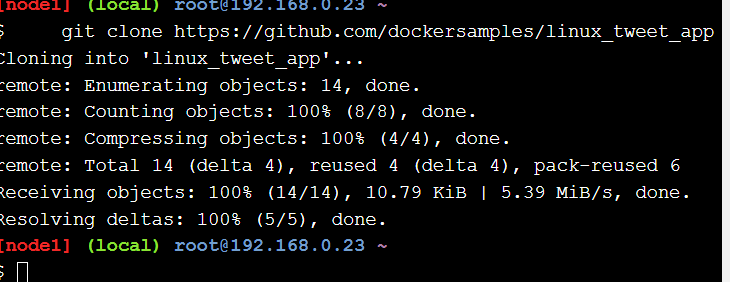

# PLAY WITH DOCKER

https://labs.play-with-docker.com/p/cpuphdgl2o9000fnt9eg#cpuphdgl_cpuphg0l2o9000fnt9f0

https://training.play-with-docker.com/

Objetivos

• Comprender los fundamentos de la gestión de recursos en Docker, incluyendo contenedores,
imágenes, redes y volúmenes.
• Aprender a utilizar Play with Docker para experimentar y aprender sobre Docker en un entorno
seguro y accesible.
• Demostrar cómo PWD proporciona un entorno de Docker completo y accesible desde un
navegador web, eliminando la necesidad de configuraciones complejas o el uso de recursos
locales.
• Enfatizar la capacidad de PWD para ofrecer un entorno de aprendizaje interactivo, donde los
usuarios pueden experimentar con Docker de forma práctica, cometiendo errores y
aprendiendo de ellos en un entorno controlado y sin riesgos.
• Destacar cómo PWD facilita la experimentación rápida con diferentes características de Docker,
permitiendo a los usuarios probar nuevas ideas, configuraciones o arquitecturas de aplicaciones
sin demoras.
• Subrayar la importancia de tener un entorno aislado para aprender y probar, que PWD ofrece,
donde las acciones de un usuario no afectan a otros usuarios o al entorno de producción.

# STAGE 1

# **Tarea 0: Requisitos previos**

Recursos: 

- Un clon del repositorio de GitHub del laboratorio.
- Un DockerID.

# **Clonar el repositorio de GitHub del laboratorio**

Utilizamos el siguiente comando para clonar el repositorio del laboratorio desde GitHub (puede hacer clic en el comando o escribirlo manualmente). Esto hará una copia del repositorio del laboratorio en un nuevo subdirectorio llamado `linux_tweet_app`.

```
    git clone https://github.com/dockersamples/linux_tweet_app
```



# **Tarea 1: Ejecutar algunos contenedores Docker simples**

Hay diferentes formas de utilizar contenedores. Éstas incluyen:

1. **Para ejecutar una sola tarea:**
    
    podría ser un script de shell o una aplicación personalizada.
    
2. **Interactivamente:**
    
    esto lo conecta al contenedor de manera similar a la forma en que utiliza SSH en un servidor remoto.
    
3. **En segundo plano:**
    
    para servicios de larga duración, como sitios web y bases de datos.
    

En esta sección probará cada una de esas opciones y verá cómo Docker administra la carga de trabajo.

# **Ejecute una sola tarea en un contenedor Alpine Linux**

En este paso, iniciaremos un nuevo contenedor y le indicaremos que ejecute el `hostname`comando. El contenedor se iniciará, ejecutará el `hostname`comando y luego saldrá.

1. Ejecutamos el siguiente comando en su consola Linux.
    
    ```
     docker container run alpine hostname
    ```
    
    El resultado que se muestra a continuación muestra que `alpine:latest`no se pudo encontrar la imagen localmente. Cuando esto sucede, Docker la *obtiene* automáticamente de Docker Hub.
    
    Después de extraer la imagen, se muestra el nombre de host del contenedor ( `888e89a3b36b`en el ejemplo siguiente).
    
    
    
2. Docker mantiene un contenedor en ejecución mientras el proceso que inició dentro del contenedor siga ejecutándose. En este caso, el `hostname`proceso finaliza tan pronto como se escribe la salida. Esto significa que el contenedor se detiene. Sin embargo, Docker no elimina los recursos de forma predeterminada, por lo que el contenedor aún existe en ese `Exited`estado.
    
    Enumeramos todos los contenedores.
    
    ```
     docker container ls --all
    
    ```
    
    Observamos que su contenedor Alpine Linux está en el `Exited`estado.
    
    
    
    > Nota: El ID del contenedor es el nombre de host que mostró el contenedor. En el ejemplo anterior es **1d7c52d4883e**
    > 

Los contenedores que realizan una tarea y luego salen pueden resultar muy útiles. Podrías crear una imagen de Docker que ejecute un script para configurar algo. Cualquiera puede ejecutar esa tarea simplemente ejecutando el contenedor; no necesitan los scripts ni la información de configuración reales.

# **Ejecutar un contenedor interactivo de Ubuntu**

Podemos ejecutar un contenedor basado en una versión de Linux diferente a la que se ejecuta en su host Docker.

En el siguiente ejemplo, vamos a ejecutar un contenedor Ubuntu Linux sobre un host Docker de Alpine Linux (Play With Docker usa Alpine Linux para sus nodos).

1. Ejecute un contenedor Docker y acceda a su shell.
    
    ```
     docker container run --interactive --tty --rm ubuntu bash
    
    ```
    
    En este ejemplo, le damos a Docker tres parámetros:
    
    - `-interactive`
        
        dice que quieres una sesión interactiva.
        
    - `-tty`
        
        asigna un pseudo-tty.
        
    - `-rm`
        
        Le dice a Docker que siga adelante y elimine el contenedor cuando termine de ejecutarse.
        
    
    Los dos primeros parámetros le permiten interactuar con el contenedor Docker.
    
    También le indicamos al contenedor que se ejecute `bash`como su proceso principal (PID 1).
    
    Cuando se inicie el contenedor, accederá al shell bash con el mensaje predeterminado `root@<container id>:/#`. Docker se ha conectado al shell en el contenedor, transmitiendo entrada y salida entre su sesión local y la sesión del shell en el contenedor.
    
    
    
2. Ejecutar los siguientes comandos en el contenedor.
    
    `ls /`listará el contenido del directorio raíz en el contenedor, `ps aux`mostrará los procesos en ejecución en el contenedor, `cat /etc/issue`mostrará qué distribución de Linux está ejecutando el contenedor, en este caso Ubuntu 20.04.3 LTS.
    
    ```
    ls /
    ```
    
    ```
    ps aux
    ```
    
    ```
    cat /etc/issue
    ```
    
3. Escribimos `exit`para abandonar la sesión de shell. Esto finalizará el `bash`proceso y hará que el contenedor salga.
    
    ```
     exit
    ```
    

1. Por diversión, verifiquemos la versión de nuestra máquina virtual host.
    
    ```
     cat /etc/issue
    
    ```
    
    Debería ver:
    
     `Welcome to Alpine Linux 3.8
     Kernel \r on an \m (\l)`
    
    
    

# **Ejecutar un contenedor MySQL en segundo plano**

Los contenedores en segundo plano son la forma en la que se ejecutan la mayoría de las aplicaciones. Aquí se muestra un ejemplo sencillo con MySQL.

1. Ejecute un nuevo contenedor MySQL con el siguiente comando.
    
    ```
     docker container run \
     --detach \
     --name mydb \
     -e MYSQL_ROOT_PASSWORD=my-secret-pw \
     mysql:latest
    ```
    
    - `-detach`
        
        ejecutará el contenedor en segundo plano.
        
    - `-name`**mydb**
        
        lo llamará
        
        .
        
    - `e`
        
        utilizará una variable de entorno para especificar la contraseña de root (NOTA: Esto nunca debe hacerse en producción).
        
    
    Como la imagen MySQL no estaba disponible localmente, Docker la extrajo automáticamente de Docker Hub.
    
    Mientras el proceso MySQL esté ejecutándose, Docker mantendrá el contenedor ejecutándose en segundo plano.
    
    
    
2. Enumeramos los contenedores en ejecución.
    
    ```
     docker container ls
    
    ```
    
    Observamos que su contenedor se está ejecutando.
    
    
    
3. Podemos comprobar lo que sucede en sus contenedores utilizando un par de comandos integrados de Docker: `docker container logs`y `docker container top`.
    
    ```
     docker container logs mydb
    ```
    
    Esto muestra los registros del contenedor MySQL Docker.
    
    
    
    Veamos los procesos que se ejecutan dentro del contenedor.
    
    ```
       docker container top mydb
    ```
    
    deberiamos ver que el demonio MySQL ( `mysqld`) se está ejecutando en el contenedor.
    
    
    
    Aunque MySQL se está ejecutando, está aislado dentro del contenedor porque no se han publicado puertos de red en el host. El tráfico de red no puede llegar a los contenedores desde el host a menos que se publiquen los puertos explícitamente.
    
4. Enumeramos la versión de MySQL utilizando `docker container exec`.
    
    `docker container exec`permite ejecutar un comando dentro de un contenedor. En este ejemplo, usaremos `docker container exec`para ejecutar el equivalente de línea de comandos `mysql --user=root --password=$MYSQL_ROOT_PASSWORD --version`dentro de nuestro contenedor MySQL.
    
    ```
     docker exec -it mydb \
     mysql --user=root --password=$MYSQL_ROOT_PASSWORD --version
    ```
    
    Verá el número de versión de MySQL, así como una útil advertencia.
    
    
    
5. También puede utilizar `docker container exec`para conectarse a un nuevo proceso de shell dentro de un contenedor que ya se esté ejecutando. Al ejecutar el comando a continuación, obtendrá un shell interactivo ( `sh`) dentro de su contenedor MySQL.
    
    ```
     docker exec -it mydb sh
    ```
    
    Observe que su indicador de shell ha cambiado. Esto se debe a que su shell ahora está conectado al `sh`proceso que se ejecuta dentro de su contenedor.
    
    
    
6. Verifiquemos el número de versión ejecutando el mismo comando nuevamente, solo que esta vez desde la nueva sesión de shell en el contenedor.
    
    ```
     mysql --user=root --password=$MYSQL_ROOT_PASSWORD --version
    ```
    
    Observe que la salida es la misma que antes.
    
7. Escriba `exit`para salir de la sesión de shell interactiva.
    
    ```
     exit
    ```
    
    
    

# **Tarea 2: Empaquetar y ejecutar una aplicación personalizada usando Docker**

En este paso aprenderá cómo empaquetar sus propias aplicaciones como imágenes Docker usando un [Dockerfile](https://docs.docker.com/engine/reference/builder/) .

La sintaxis de Dockerfile es sencilla. En esta tarea, crearemos un sitio web NGINX simple a partir de un Dockerfile.

# **Cree una imagen de sitio web simple**

Echemos un vistazo al Dockerfile que usaremos, que crea un sitio web simple que le permite enviar un tweet.

1. Nos aseguramos de estar en el `linux_tweet_app`directorio.
    
    ```
     cd ~/linux_tweet_app
    ```
    
    
    
2. Mostramos el contenido del Dockerfile.
    
    ```
     cat Dockerfile
    ```
    
    Veamos qué hace cada una de estas líneas en el Dockerfile.
    
    
    
    - [FROM](https://docs.docker.com/engine/reference/builder/#from)`nginx:latest`
        
        especifica la imagen base que se utilizará como punto de partida para la nueva imagen que estás creando. En este ejemplo, comenzamos desde
        
        .
        
    - [COPY](https://docs.docker.com/engine/reference/builder/#copy)`COPYindex.html`
        
        copia archivos del host Docker a la imagen, en una ubicación conocida. En este ejemplo,
        
        se utiliza para copiar dos archivos en la imagen:
        
        . y un gráfico que será utilizado en nuestra página web.
        
    - [EXPONER](https://docs.docker.com/engine/reference/builder/#expose)
        
        documentos que utilizan la aplicación.
        
    - [CMD](https://docs.docker.com/engine/reference/builder/#cmd)
        
        especifica qué comando se debe ejecutar cuando se inicia un contenedor desde la imagen. Observe que podemos especificar el comando, así como los argumentos de tiempo de ejecución.
        
3. Para que los siguientes comandos sean más fáciles de copiar y pegar, exporte una variable de entorno que contenga su DockerID (si no tiene un DockerID, puede obtener uno gratis a través de [Docker Hub](https://hub.docker.com/) ).
    
    Tendrá que escribir este comando manualmente, ya que requiere su DockerID único.
    
    `export DOCKERID=<your docker id>`
    
4. Haga eco del valor de la variable al terminal para asegurarse de que se almacenó correctamente.
    
    ```
     echo $DOCKERID
    ```
    
5. Utilice el `docker image build`comando para crear una nueva imagen de Docker siguiendo las instrucciones del Dockerfile.
    - `-tag`
        
        nos permite darle a la imagen un nombre personalizado. En este caso se compone de nuestro DockerID, el nombre de la aplicación y una versión. Tener el ID de Docker adjunto al nombre nos permitirá almacenarlo en Docker Hub en un paso posterior.
        
    - `.`
        
        Le dice a Docker que use el directorio actual como contexto de compilación
        
    
    Asegúrese de incluir un punto ( `.`) al final del comando.
    
    ```
     docker image build --tag $DOCKERID/linux_tweet_app:1.0 .
    
    ```
    
    La salida a continuación muestra el demonio Docker ejecutando cada línea en el Dockerfile
    
    
    
6. Utilizamos el comando `docker container run`comando para iniciar un nuevo contenedor a partir de la imagen que creó.
    
    Como este contenedor ejecutará un servidor web NGINX, usaremos el `--publish`indicador para publicar el puerto 80 dentro del contenedor en el puerto 80 del host. Esto permitirá que el tráfico que ingresa al host Docker en el puerto 80 se dirija al puerto 80 en el contenedor. El formato del `--publish`indicador es `host_port`: `container_port`.
    
    ```
     docker container run \
     --detach \
     --publish 80:80 \
     --name linux_tweet_app \
     $DOCKERID/linux_tweet_app:1.0
    ```
    
    Cualquier tráfico externo que ingrese al servidor en el puerto 80 ahora se dirigirá al contenedor en el puerto 80.
    
    En un paso posterior verá cómo mapear el tráfico desde dos puertos diferentes; esto es necesario cuando dos contenedores usan el mismo puerto para comunicarse, ya que solo puede exponer el puerto una vez en el host.
    
7. [Haga clic aquí para cargar el sitio web](https://training.play-with-docker.com/) que debería estar ejecutándose.
8. Una vez que haya accedido a su sitio web, ciérrelo y elimínelo.
    
    ```
     docker container rm --force linux_tweet_app
    
    ```
    
    > Nota: Usamos el --forceparámetro para eliminar el contenedor en ejecución sin cerrarlo. Esto cerrará el contenedor de forma desagradable y lo eliminará permanentemente del host Docker.
    > 
    > 
    > En un entorno de producción, es posible que desee utilizarlo `docker container stop`para detener correctamente el contenedor y dejarlo en el host. Luego puedes utilizarlo `docker container rm`para eliminarlo permanentemente.
    > 

# **Tarea 3: modificar un sitio web en ejecución**

Cuando estás trabajando activamente en una aplicación, es inconveniente tener que detener el contenedor, reconstruir la imagen y ejecutar una nueva versión cada vez que realizas un cambio en tu código fuente.

Una forma de agilizar este proceso es montar el directorio del código fuente de la máquina local en el contenedor en ejecución. Esto permitirá que cualquier cambio realizado en los archivos del host se refleje inmediatamente en el contenedor.

Hacemos esto usando algo llamado [montaje de enlace](https://docs.docker.com/engine/admin/volumes/bind-mounts/) .

Cuando se utiliza un montaje de enlace, un archivo o directorio en la máquina host se monta en un contenedor que se ejecuta en el mismo host.

# **Inicie nuestra aplicación web con un montaje vinculado**

1. Iniciemos la aplicación web y montemos el directorio actual en el contenedor.
    
    En este ejemplo usaremos la `--mount`bandera para montar el directorio actual en el host `/usr/share/nginx/html`dentro del contenedor.
    
    Asegúrese de ejecutar este comando desde el `linux_tweet_app`directorio en su host Docker.
    
    ```
     docker container run \
     --detach \
     --publish 80:80 \
     --name linux_tweet_app \
     --mount type=bind,source="$(pwd)",target=/usr/share/nginx/html \
     $DOCKERID/linux_tweet_app:1.0
    ```
    
    > Recuerde que el Dockerfile /usr/share/nginx/htmles donde se almacenan los archivos html para la aplicación web.
    > 
2. El [sitio web](https://training.play-with-docker.com/) debería estar funcionando.


# **Modificar el sitio web en ejecución**

Los montajes enlazados significan que cualquier cambio realizado en el sistema de archivos local se refleja inmediatamente en el contenedor en ejecución.

1. Copie uno nuevo `index.html`en el contenedor.
    
    El repositorio de Git que extrajiste anteriormente contiene varias versiones diferentes de un archivo index.html. Puedes ejecutar un `ls`comando manualmente desde el `~/linux_tweet_app`directorio para ver una lista de ellas. En este paso, reemplazaremos `index.html`por `index-new.html`.
    
    ```
     cp index-new.html index.html
    ```
    
2. Vaya al [sitio web](https://training.play-with-docker.com/) en ejecución y **actualice la página** . Observe que el sitio ha cambiado.
    
    > Si te sientes cómodo con viél, puedes usarlo para cargar el index.htmlarchivo local y realizar cambios adicionales. Estos también se verán reflejados cuando vuelvas a cargar la página web. Si eres realmente aventurero, ¿por qué no intentas usarlo execpara acceder al contenedor en ejecución y modificar los archivos almacenados allí?
    > 

Aunque modificamos el `index.html`sistema de archivos local y lo vimos reflejado en el contenedor en ejecución, en realidad no cambiamos la imagen de Docker desde la que se inició el contenedor.

Para demostrar esto, detenga el contenedor actual y vuelva a ejecutar la `1.0`imagen sin un montaje de enlace.

1. Detenga y elimine el contenedor que se está ejecutando actualmente.
    
    ```
     docker rm --force linux_tweet_app
    ```
    
    
    
2. Vuelva a ejecutar la versión actual sin un montaje de enlace.
    
    ```
     docker container run \
     --detach \
     --publish 80:80 \
     --name linux_tweet_app \
     $DOCKERID/linux_tweet_app:1.0
    ```
    
3. Tenga en cuenta que el [sitio web](https://training.play-with-docker.com/) ha vuelto a la versión original.
4. Detener y eliminar el contenedor actual
    
    ```
    docker rm --force linux_tweet_app
    ```
    
    
    

# **Actualizar la imagen**

Para conservar los cambios realizados en el `index.html`archivo en la imagen, debe crear una nueva versión de la imagen.

1. Crea una nueva imagen y etiquétala como`2.0`
    
    Recuerde que previamente modificó el `index.html`archivo en el sistema de archivos local del host Docker. Esto significa que ejecutar otro `docker image build`comando creará una nueva imagen con la versión actualizada.`index.html`
    
    Asegúrese de incluir el punto ( `.`) al final del comando.
    
    ```
     docker image build --tag $DOCKERID/linux_tweet_app:2.0 .
    
    ```
    
    ¡Observe lo rápido que se construyó! Esto se debe a que Docker solo modificó la parte de la imagen que cambió en lugar de reconstruir la imagen completa.
    
    [https://www.notion.so](https://www.notion.so)
    
2. Veamos las imágenes del sistema.
    
    ```
     docker image ls
    
    ```
    
    Ahora tienes ambas versiones de la aplicación web en tu host.
    
    
    

# **Probar la nueva versión**

1. Ejecute un nuevo contenedor desde la nueva versión de la imagen.
    
    ```
     docker container run \
     --detach \
     --publish 80:80 \
     --name linux_tweet_app \
     $DOCKERID/linux_tweet_app:2.0
    ```
    
    
    
2. Verifique la nueva versión del [sitio web](https://training.play-with-docker.com/) ( **es posible que deba actualizar su navegador para que se cargue la nueva versión** ).
    
    La página web tendrá un fondo naranja.
    
    Podemos ejecutar ambas versiones una al lado de la otra. Lo único que debemos tener en cuenta es que no podemos tener dos contenedores usando el puerto 80 en el mismo host.
    
    Como ya estamos usando el puerto 80 para el contenedor que se ejecuta desde la `2.0`versión de la imagen, iniciaremos un nuevo contenedor y lo publicaremos en el puerto 8080. Además, debemos darle a nuestro contenedor un nombre único ( `old_linux_tweet_app`)
    
3. Ejecute otro contenedor nuevo, esta vez desde la versión anterior de la imagen.
    
    Tenga en cuenta que este comando asigna el nuevo contenedor al puerto 8080 en el host. Esto se debe a que dos contenedores no pueden asignarse al mismo puerto en un solo host de Docker.
    
    ```
     docker container run \
     --detach \
     --publish 8080:80 \
     --name old_linux_tweet_app \
     $DOCKERID/linux_tweet_app:1.0
    ```
    
    
    
4. Ver la versión antigua del [sitio web](https://training.play-with-docker.com/) .

# **Envía tus imágenes a Docker Hub**

1. Enumere las imágenes en su host Docker.
    
    ```
     docker image ls -f reference="$DOCKERID/*"
    
    ```
    
    Verá que ahora tiene dos `linux_tweet_app`imágenes: una etiquetada como `1.0`y la otra como `2.0`.
    
    
    
    Estas imágenes solo se almacenan en el repositorio local de su host Docker. Su host Docker se eliminará después del taller. En este paso, enviaremos las imágenes a un repositorio público para que pueda ejecutarlas desde cualquier máquina Linux con Docker.
    
    La distribución está integrada en la plataforma Docker. Puedes crear imágenes localmente y enviarlas a un [registro](https://docs.docker.com/registry/) público o privado , lo que las pone a disposición de otros usuarios. Cualquiera con acceso puede extraer esa imagen y ejecutar un contenedor desde ella. El comportamiento de la aplicación en el contenedor será el mismo para todos, porque la imagen contiene la aplicación completamente configurada; los únicos requisitos para ejecutarla son Linux y Docker.
    
    [Docker Hub](https://hub.docker.com/) es el registro público predeterminado para imágenes de Docker.
    
2. Antes de poder enviar sus imágenes, deberá iniciar sesión en Docker Hub.
    
    ```
     docker login
    ```
    
    Necesitará proporcionar sus credenciales de ID de Docker cuando se le solicite.
    
     `Username: <your docker id>
     Password: <your docker id password>
     Login Succeeded`
    
    
    
3. Envíe la versión `1.0`de su aplicación web usando `docker image push`.
    
    ```
     docker image push $DOCKERID/linux_tweet_app:1.0
    
    ```
    
    Verá el progreso a medida que la imagen se suba a Docker Hub.
    
    
    
4. Ahora empuje la versión `2.0`.
    
    ```
     docker image push $DOCKERID/linux_tweet_app:2.0
    
    ```
    
    Tenga en cuenta que varias líneas de la salida dicen `Layer already exists`. Esto se debe a que Docker aprovechará las capas de solo lectura que son iguales a cualquier capa de imagen cargada previamente.
    
    
    

# STAGE 2

# **Prerrequisitos**

- [Docker para OSX o Docker para Windows](https://www.docker.com/products/docker)
- [Edición comunitaria IntelliJ](https://www.jetbrains.com/idea/download/)
- [Kit de desarrollo Java](http://www.oracle.com/technetwork/java/javase/downloads/jdk8-downloads-2133151.html)

# **Empezando**

En IntelliJ, clone el repositorio. Haga clic en `Check out from Version Control`>`Github`

En la línea de comando, clone el repositorio [de Docker/Labs.](https://github.com/docker/labs)


Haga clic `Project View`para abrir el proyecto.


# **Construyendo la aplicación**

La aplicación es una aplicación Spring MVC básica que recibe la entrada del usuario desde un formulario, escribe los datos en una base de datos y consulta la base de datos.

La aplicación está construida con Maven. Para crear la aplicación, haga clic en el icono en la parte inferior izquierda de la ventana de IntelliJ y seleccione `Maven Projects`.


La `Maven Projects`ventana se abrirá en el lado derecho. Los objetivos de Maven `clean`y `install`deben establecerse para crear la aplicación.

Para establecer el `clean`objetivo, haga clic en `Lifecycle`para mostrar el árbol de objetivos. Haga clic derecho `clean`y seleccione`Create 'UserSignup [clean]'...`


Haga clic `OK`en la `Create Run/Debug Configuration`ventana.

Para crear la aplicación, ejecute`clean`


Cuando se compile la aplicación, verá un mensaje de éxito en la ventana de registro.


# **Ejecutando la aplicación**

Abra una terminal y vaya al directorio de la aplicación. Inicie la aplicación con docker-compose

```
> docker-compose up
```


Docker creará las imágenes para Apache Tomcat y MySQL y luego iniciará los contenedores. También montará el directorio de la aplicación ( `./app/target/UserSignup`) como un volumen de datos en el sistema host en el directorio de aplicaciones web de Tomcat en el contenedor del servidor web.

Abra una ventana del navegador y vaya a: 'localhost:8080'; debería ver la página de inicio de Tomcat

Puede utilizar la página Administrador para `Start`, `Stop`, `Reload`o `Undeploy`aplicaciones web.

Para ir a la aplicación, haga clic en `/UserSignup`el enlace.


# **Depurar la aplicación**

En la aplicación, haga clic en `Signup`para crear un nuevo usuario. Complete el formulario de registro y haga clic`Submit`


Haga clic `Yes`para confirmar.

