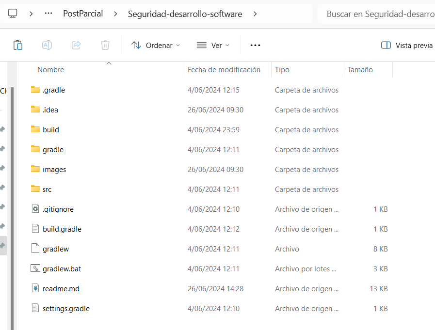

# Seguridad desarrollo softwre

Actividad hecha el 4/06/2024



# Ejercicio 1: Modelo de árbol de Ataque

Implementa un modelo de árbol de ataque en Java. Debes crear una clase AttackTreeNode que
represente un nodo en el árbol de ataque y una clase AttackTree que gestione la estructura del
árbol.

**Requisitos**:
• La clase **AttackTreeNode** debe tener propiedades para almacenar la descripción del ataque,
el costo estimado, la probabilidad de éxito y los nodos hijos.
• La clase **AttackTree** debe permitir agregar nodos, calcular el riesgo total (suma del costo
estimado multiplicado por la probabilidad de éxito para cada nodo) y encontrar rutas críticas
(ruta con el mayor riesgo).

Resolucion :

Para ello usamos una estructura de datos de arbol (ya se binario o n-ario)

Ademas implementamos metodos recursivos para calcular el riesgo total y encontrar rutas criticias : `calculateRiskRecursively` y `findCriticalPathRecursively`

**Clase AttackTree**

```java
package org.example;
import java.util.*;
class AttackTree {
    private AttackTreeNode root; // raíz
    public AttackTree(AttackTreeNode root) {
        // Asignar la raíz
        this.root = root;
    }
    public double calculateTotalRisk() {
        return calculateRiskRecursively(root);// Calcular el riesgo total
    }
    private double calculateRiskRecursively(AttackTreeNode node) {
        double totalRisk = node.getRisk(); // Calcular el riesgo de este nodo
        for (AttackTreeNode child : node.getChildren()) {
            totalRisk += calculateRiskRecursively(child);// Calcular el riesgo de los descendientes
        }
        return totalRisk;
    }
    // Método para encontrar la ruta crítica
    public List<AttackTreeNode> findCriticalPath() {
        List<AttackTreeNode> path = new ArrayList<>();
        findCriticalPathRecursively(root, path);
        return path;
    }
    private double findCriticalPathRecursively(AttackTreeNode node, List<AttackTreeNode> path) {
        path.add(node); // Agregar el nodo actual a la ruta
        if (node.getChildren().isEmpty()) {
            return node.getRisk();// Si el nodo no tiene descendientes, devolver el riesgo
        }
        double maxRisk = 0;
        AttackTreeNode criticalChild = null;
        for (AttackTreeNode child : node.getChildren()) {
            double childRisk = findCriticalPathRecursively(child, new ArrayList<>());// Calcular el riesgo de los descendientes
            if (childRisk > maxRisk) {
                maxRisk = childRisk;
                criticalChild = child;
            }
        }
        if (criticalChild != null) { // Si hay un nodo crítico
            path.add(criticalChild); // Agregar el nodo crítico a la ruta
        }
        return maxRisk + node.getRisk();// Calcular el riesgo total
    }
}
```

**Clase AttackTreeNode**

```java
package org.example;

import java.util.*;

public class AttackTreeNode {
    private String description; // Descripción del ataque
    private double estimatedCost; // Costo estimado
    private double probabilityOfSuccess;// Probabilidad de exito
    private List<AttackTreeNode> children; // Hijos del ataque
    public AttackTreeNode(String description, double estimatedCost, double probabilityOfSuccess) {
        // Constructor
        this.description = description;
        this.estimatedCost = estimatedCost;
        this.probabilityOfSuccess = probabilityOfSuccess;
        this.children = new ArrayList<>();
    }
    public void addChild(AttackTreeNode child) {
        children.add(child);// Agregar un hijo
    }
    public List<AttackTreeNode> getChildren() {
        return children;// Obtener los hijos
    }
    public double getRisk() {
        return estimatedCost * probabilityOfSuccess;// Obtener el riesgo
    }
    public String getDescription() {
        return description;// Obtener la descripción
    }

}

```

## Ejercicio 2: Sistema de autenticación y autorización

- e2
    
    Implementa un sistema de autenticación y autorización que verifique roles y permisos de usuarios.
    Debes crear clases para representar **User, Role, y Permission.**
    
    **Requisitos:**
    • La clase **User** debe tener un nombre de usuario, una contraseña (encriptada) y una lista de
    roles.
    • La clase **Role** debe tener un nombre y una lista de permisos.
    • La clase **Permission** debe tener un nombre y una descripción.
    • Implementa un método para autenticar usuarios basado en su nombre de usuario y
    contraseña.
    • Implementa un método para verificar si un usuario tiene un permiso específico.
    
    Resolucion :
    • Utilizamos una librería de encriptación para las contraseñas, como java.security.
    • Implementamos métodos de verificación que recorren las listas de roles y permisos del usuario.
    
    **Clase User** 
    
    ```java
    package org.example.ejercicio2;
    
    import java.security.MessageDigest;
    import java.security.NoSuchAlgorithmException;
    import java.util.ArrayList;
    import java.util.Base64;
    import java.util.List;
    
    public class User {
        private String username;
        private String encryptedPassword;
        private List<Role> roles;
        public User(String username, String password) throws NoSuchAlgorithmException {
            this.username = username;
            this.encryptedPassword = encryptPassword(password);
            this.roles = new ArrayList<>();
        }
        private String encryptPassword(String password) throws NoSuchAlgorithmException {
            MessageDigest md = MessageDigest.getInstance("SHA-256");
            byte[] hash = md.digest(password.getBytes());
            return Base64.getEncoder().encodeToString(hash);
        }
        public void addRole(Role role) {
            roles.add(role);
        }
        public boolean authenticate(String username, String password) throws NoSuchAlgorithmException
        {
            return this.username.equals(username) &&
                    this.encryptedPassword.equals(encryptPassword(password));
        }
        public boolean hasPermission(String permissionName) {
            for (Role role : roles) {
                for (Permission permission : role.getPermissions()) {
                    if (permission.getName().equals(permissionName)) {
                        return true;
                    }
                }
            }
            return false;
        }
        public String getUsername() {
            return username;
        }
    
    }
    
    ```
    
    **Clase Role**
    
    ```java
    package org.example.ejercicio2;
    
    import java.util.ArrayList;
    import java.util.List;
    
    public class Role {
        private String name;
        private List<Permission> permissions;
        public Role(String name) {
            this.name = name;
            this.permissions = new ArrayList<>();
        }
        public void addPermission(Permission permission) {
            permissions.add(permission);
        }
        public List<Permission> getPermissions() {
            return permissions;
        }
        public String getName() {
            return name;
        }
    }
    
    ```
    
    **Clase Permission**
    
    ```java
    package org.example.ejercicio2;
    
    public class Permission {
        private String name;
        private String description;
        public Permission(String name, String description) {
            this.name = name;
            this.description = description;
        }
        public String getName() {
            return name;
        }
    }
    
    ```
    
    **Clase AuthSystem**
    
    ```java
    package org.example.ejercicio2;
    
    import java.util.ArrayList;
    import java.util.List;
    
    public class AuthSystem {
            private List<User> users;
            private List<Role> roles;
            private List<Permission> permissions;
    
            public AuthSystem() {
                users = new ArrayList<>();
                roles = new ArrayList<>();
                permissions = new ArrayList<>();
            }
    
            public void addUser(User user) {
                users.add(user);
            }
    
            public void addRole(Role role) {
                roles.add(role);
            }
    
            public void addPermission(Permission permission) {
                permissions.add(permission);
            }
    
            public User findUserByUsername(String username) {
                for (User user : users) {
                    if (user.getUsername().equals(username)) {
                        return user;
                    }
                }
                return null;
            }
    
            public Role findRoleByName(String roleName) {
                for (Role role : roles) {
                    if (role.getName().equals(roleName)) {
                        return role;
                    }
                }
                return null;
            }
    
            public Permission findPermissionByName(String permissionName) {
                for (Permission permission : permissions) {
                    if (permission.getName().equals(permissionName)) {
                        return permission;
                    }
                }
                return null;
            }
    }
    
    ```
    
    **Clase Main** 
    
    ```java
    package org.example.ejercicio2;
    
    import java.security.NoSuchAlgorithmException;
    
    public class Main {
        public static void main(String[] args) {
            try {
                // Creación de permisos
                Permission readPermission = new Permission("Leer", "permisos de lectura");
                Permission writePermission = new Permission("Escribir", "permisos de escritura");
    
                // Creación de roles
                Role adminRole = new Role("ADMIN");
                adminRole.addPermission(readPermission);
                adminRole.addPermission(writePermission);
    
                Role userRole = new Role("USER");
                userRole.addPermission(readPermission);
    
                // Creación de usuarios
                User admin = new User("admin", "admin123");
                admin.addRole(adminRole);
    
                User user = new User("user", "user123");
                user.addRole(userRole);
    
                // Creación del sistema de autenticación
                AuthSystem authSystem = new AuthSystem();
                authSystem.addPermission(readPermission);
                authSystem.addPermission(writePermission);
                authSystem.addRole(adminRole);
                authSystem.addRole(userRole);
                authSystem.addUser(admin);
                authSystem.addUser(user);
    
                // Autenticación y verificación de permisos
                User authUser = authSystem.findUserByUsername("admin");
                if (authUser != null && authUser.authenticate("admin", "admin123")) {
                    System.out.println("Autenticacion existosa para "+authUser.getUsername());
                    if (authUser.hasPermission("Escribir")) {
                        System.out.println("Admin tiene permiso para escribir");
                    } else {
                        System.out.println("Admin no tiene permiso para escribir");
                    }
                } else {
                    System.out.println("Autenticacion fallida para "+authUser.getUsername());
                }
    
                authUser = authSystem.findUserByUsername("user");
                if (authUser != null && authUser.authenticate("user", "user123")) {
                    System.out.println("Autenticacion existosa para "+authUser.getUsername());
                    if (authUser.hasPermission("Leer")) {
                        System.out.println("User tiene permiso para leer ");
                    } else {
                        System.out.println("User no tiene permiso para Escribir");
                    }
                } else {
                    System.out.println("Autenticacion fallida para el"+authUser.getUsername());
                }
    
            } catch (NoSuchAlgorithmException e) {
                e.printStackTrace();
            }
        }
    
    }
    ```
    
    Creamos la clase `AuthSystem` para la autenticacion y verificacion de usuarios ,ademas la clase `Main` para mostrar las salidas : 
    
    Cuando el usuario admin tiene premiso de  escritura y lectura y se autentificque exitosamente 
    
    
    
    