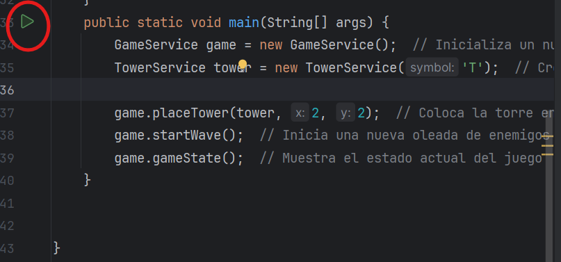

# Docker-kubernetes-Microservicios - Volumen 3

Nombre y Apellidos :Milagros Cristina Ruiz Arica 

Codigo : 20210356K

# **Descripción del proyecto: V3**

El juego "Tower Defense" es un videojuego de consola donde el jugador debe defender su base de oleadas de enemigos colocando torres en lugares estratégicos del mapa. El proyecto incluirá el uso de
mocks, stubs y fakes para pruebas unitarias y de integración
utilizando Mockito y pruebas de mutación.

## Estructura del proyecto

En el proyecto consiste en un conjunto de microservicios en Java que colaboran para simular un juego básico de defensa de torres “Tower defense “ . Cada microservicio se encarga de una funcionalidad específica del juego, como gestionar el mapa, el jugador, las torres y las oleadas de enemigos.

Clases principales en el proyecto son :

1. Microservicio de Juego (`GameService`): Maneja la lógica general del juego.
2. Microservicio de Mapa (`MapService`): Gestiona la representación y manipulación del mapa del juego.
3. Microservicio de Enemigos (`EnemyService`): Gestiona la creación y el comportamiento de los enemigos.
4. Microservicio de Torres (`TowerService`): Gestiona la creación y el comportamiento de las torres.
5. Microservicio de Oleadas (`WaveService`): Maneja la lógica de las oleadas de enemigos.
6. Microservicio de Jugador (`PlayerService`): Representa al jugador y sus estadísticas.

### Entrada y salida

Entrada:

- Datos iniciales del mapa y configuración de juego.
- Comandos del usuario para colocar torres, iniciar oleadas,etc.

Salida:

- Estado del juego después de cada comando.
- Puntuación y estado de salud de la base.

# Detalles del proyecto

### 1. GameService

El microservicio `GameService` es el controlador principal del juego , es decir quien manejara la logica principal del juego que coordina la interacción entre los diferentes microservicios: 

```java
package org.example;
import java.util.*;
public class GameService {
    private MapService mapService;  // Servicio para gestionar el mapa del juego
    private PlayerService playerService;  // Servicio para gestionar el estado del jugador
    private List<WaveService> waves;  // Lista de oleadas de enemigos

    // Constructor para  inicializar los servicios del mapa, jugador y la lista de oleadas
    public GameService() {
        this.mapService = new MapService();
        this.playerService = new PlayerService();
        this.waves = new ArrayList<>();
    }

    // Método para colocar una torre en la posición (x,y)   del mapa
    public void placeTower(TowerService tower, int x, int y) {
        mapService.placeTower(tower, x, y);
    }

    // Método para iniciar una nueva oleada de enemigos
    public void startWave() {
        WaveService wave = new WaveService();
        waves.add(wave);  // Añade la oleada a la lista de oleadas
        wave.start();  // Inicia la oleada
    }

    // Método para mostrar el estado actual del juego
    public void gameState() {
        System.out.println(mapService);  // Muestra el estado del mapa
        System.out.println("Puntuación: " + playerService.getScore());  // Muestra la puntuación del jugador
        System.out.println("Vida de la base: " + playerService.getBaseHealth());  // Muestra la vida de la base del jugador
    }
    public static void main(String[] args) {
        GameService game = new GameService();  // Inicializa un nuevo juego
        TowerService tower = new TowerService('T');  // Crea una nueva torre con el símbolo 'T'

        game.placeTower(tower, 2, 2);  // Coloca la torre en la posición (2, 2) del mapa
        game.startWave();  // Inicia una nueva oleada de enemigos
        game.gameState();  // Muestra el estado actual del juego
    }

}

```

### Métodos:

- `placeTower(TowerService tower, int x, int y)`: Coloca una torre en el mapa en la posición (x,y).
- `startWave()`: Inicia una nueva oleada de enemigos.
- `gameState()`: Muestra el estado actual del juego, incluyendo el mapa, la puntuación y la salud de la base.
- `main(String[] args)` : Inicializara el juego.

### 2. MapService

El microservicio `MapService` es quien va a gestionar el estado del mapa del juego.

```java
package org.example;

public class MapService {
    private char[][] grid;  // Matriz del mapa del juego

    // Constructor que inicializa el mapa con celdas vacias
    public MapService() {
        grid = new char[5][5];
        for (int i = 0; i < 5; i++) {
            for (int j = 0; j < 5; j++) {
                grid[i][j] = ' ';  // Cada celda se inicializa como vacia
            }
        }
    }

    // Método para colocar una torre en una posición (x,y)
    public void placeTower(TowerService tower, int x, int y) {
        grid[x][y] = tower.getSymbol();  // Coloca el símbolo de la torre en la posición dada
    }

    // Método para representar el estado del mapa como una cadena de texto
    @Override
    public String toString() {
        StringBuilder sb = new StringBuilder();
        for (char[] row : grid) {
            for (char cell : row) {
                sb.append("[").append(cell).append("]");  // Agregar cada celda a la representación en cadena
            }
            sb.append("\n");
        }
        return sb.toString();
    }
}

```

### Métodos:

- `placeTower(TowerService tower, int x, int y)`: Coloca una torre en la posición(x,y) especificada en la cuadrícula.
- `toString()`: Retorna una representación en cadena del estado actual del mapa.

### 3. PlayerService

El microservicio `PlayerService` gestiona la puntuación y la vida de la base del jugador.

```java
package org.example;

public class PlayerService {
    private int score;  // Puntuacion del jugador
    private int baseHealth;  // Vida de la base del jugador

    // Constructor para inicializar la puntuacion y la vida de la base
    public PlayerService() {
        this.score = 0;
        this.baseHealth = 100;
    }

    // Metodo para obtener la puntuacion actual del jugador
    public int getScore() {
        return score;
    }

    // Metodo para obtener la vida actual de la base del jugador
    public int getBaseHealth() {
        return baseHealth;
    }
}

```

### Métodos:

- `getScore()`: Retorna la puntuación actual del jugador.
- `getBaseHealth()`: Retorna la vida actual de la base del jugador.

### 4. TowerService

El micorservicio `TowerService` representa una torre en el juego.

```java
package org.example;

public class TowerService {
    private char symbol;  // Símbolo que representa la torre en el mapa "T"

    // Constructor
    public TowerService(char symbol) {
        this.symbol = symbol;
    }

    // Método para obtener el símbolo de la torre
    public char getSymbol() {
        return symbol;
    }
}

```

### Métodos:

- `getSymbol()`: Retorna el símbolo que representa la torre en el mapa.

### 5. WaveService

El microservicio `WaveService` gestiona la lógica de las oleadas de enemigos.

```java
package org.example;

public class WaveService {
    // Método para iniciar una oleada de enemigos
    public void start() {
        System.out.println("Oleada iniciada!");  // Muestra un mensaje indicando que la oleada ha comenzado
    }
}

```

### Métodos:

- `start()`: Inicia la oleada de enemigos.

## Ejecucion del juego

Ejecutaremos el juego a partir del metodo `main()` de la clase `GameService`  : 



Salida en consola : 


El juego se ha ejecutado correctamente mostrando inicialmente el mapa , la puntuación inicial del jugador y la vida de la base(100).

# Crear Dockerfile para cada microservicio

Para facilitar el despliegue y la ejecución de cada microservicio, crearemos Dockerfiles específicos para cada uno de los microservicios. Cada Dockerfile servirán para crear imagenes docker que puede ser ejecutada en cualquier entorno soportado por Docker. Aqui podemos ver la función de docker como la portabilidad.

### 1. Dockerfile para GameService

Este archivo crea una imagen de Docker para el `GameService`, que es el controlador principal del juego.

```
# Utiliza una imagen base con OpenJDK 17 (version que uso para el proyecto)
FROM openjdk:17

# Crea y cambia el directorio /app
WORKDIR /app

# Copia todos los archivos del directorio actual al directorio de trabajo en el contenedor
COPY . /app

# Compila el archivo GameService.java
RUN chmod +x ./gradlew build

# Define el comando predeterminado para ejecutar el servicio java ,-cp , ruta del archivo , nombre del microseervicio
CMD ["java","-cp","src/main/java/org/example/main" ,"GameService"]

```

### 2. Dockerfile para MapService

Este archivo crea  de Docker para el `MapService`, que gestiona el estado del mapa del juego.

```
# Utiliza una imagen base con OpenJDK 17 (version que uso para el proyecto)
FROM openjdk:17

# Crea y cambia el directorio /app
WORKDIR /app

# Copia todos los archivos del directorio actual al directorio de trabajo en el contenedor
COPY . /app

# Compila el archivo MapService.java
RUN chmod +x ./gradlew build

# Define el comando predeterminado para ejecutar el servicio
CMD ["java","-cp","src/main/java/org/example" ,"MapService"]

```

### 3. Dockerfile para PlayerService

Este archivo crea de Docker para el `PlayerService`, el cual gestiona la puntuación y la vida de la base del jugador.

```
# Utiliza una imagen base con OpenJDK 17 (version que uso para el proyecto)
FROM openjdk:17

# Crea y cambia el directorio /app
WORKDIR /app

# Copia todos los archivos del directorio actual al directorio de trabajo en el contenedor
COPY . /app

# Compila el archivo PlayerService.java
RUN chmod +x ./gradlew build

# Define el comando predeterminado para ejecutar el servicio
CMD ["java","-cp","src/main/java/org/example" ,"PlayService"]

```

### 4. Dockerfile para TowerService

Este archivo crea  de Docker para el `TowerService`, que representa una torre en el juego.

```
# Utiliza una imagen base con OpenJDK 17 (version que uso para el proyecto)
FROM openjdk:17

# Crea y cambia el directorio /app
WORKDIR /app

# Copia todos los archivos del directorio actual al directorio de trabajo en el contenedor
COPY . /app

# Compila el archivo TowerService.java
RUN javac TowerService.java

# Define el comando predeterminado para ejecutar el servicio java ,-cp , ruta del archivo , nombre del microseervicio
CMD ["java", "TowerService"]

```

### 5. Dockerfile para WaveService

Este archivo crea  de Docker para el `WaveService`, que se encarga de la lógica de las oleadas de enemigos.

```
# Utiliza una imagen base con OpenJDK 17 (version que uso para el proyecto)
FROM openjdk:17

# Crea y cambia el directorio /app
WORKDIR /app

# Copia todos los archivos del directorio actual al directorio de trabajo en el contenedor
COPY . /app

# Compila el archivo WaveService.java
RUN javac WaveService.java

# Define el comando predeterminado para ejecutar el servicio java ,-cp , ruta del archivo , nombre del microseervicio
CMD ["java", "WaveService"]
```

Procedemos a construir las imagenes  de cada microservicio ejecutando el siguiente comando : 

```bash
docker build -t <nombre-de-la-imagen> -f <nombre-Dockerfile> .
```

### **GameService:**

Ejecutamos el comando : 

`docker build -t gameservice-image -f DockerfileGameService .`


**Explicacion** : La salida nos muestra la fecha en la que se construyo la imagen **gameservice-image** y la correcta creación de esta ,ademas de mostrarnos el hash , que es el identificador único de la imagen creada (`sha256:318c521277f28b7e3fbb8f7e05b6c6c64bc15105dc81689569b7138848471011` ).

### **MapService:**

Ejecutamos el comando : 

`docker build -t mapservice-image -f DockerfileMapService .`


**Explicacion** : La salida nos muestra la fecha en la que se construyo la imagen **mapservice-image** y la correcta creación de esta ,ademas de mostrarnos el hash , que es el identificador único de la imagen creada (`sha256:beacde044087d8dd84a3368293f84ce493c8bc2` ).

### PlayerService**:**

Ejecutamos el comando : 

`docker build -t playerservice-image -f DockerfilePlayerService .`


**Explicacion** : La salida nos muestra la fecha en la que se construyo la imagen **playerservice-image** y la correcta creación de esta ,ademas de mostrarnos el hash , que es el identificador único de la imagen creada (`sha256:f6608361d9eceec42f24284b0e571143465304ad20c632502828` ).

### TowerService**:**

Ejecutamos el comando : 

`docker build -t towerservice-image -f DockerfileTowerService .`


**Explicacion** : La salida nos muestra la fecha en la que se construyo la imagen **towerservice-image** y la correcta creación de esta ,ademas de mostrarnos el hash , que es el identificador único de la imagen creada (`sha256:66ed013022d28d92417c88bb091c4caf58619e2b1bd5702db87c` ).

### WaveService**:**

Ejecutamos el comando : 

`docker build -t waveservice-image -f DockerfileWaveService .`


**Explicacion** : La salida nos muestra la fecha en la que se construyo la imagen **waveservice-image** y la correcta creación de esta ,ademas de mostrarnos el hash , que es el identificador único de la imagen creada (`sha256:a8d854cef6aff6ebea7c79bd0b66f5589e4c37733700591ce231` ).

# Crear Docker Compose para microservicios

A continuación crearemos el archivo `docker-compose.yml` que define los servicios para cada microservicio del proyecto:

```bash
version: '2.26.1'

services:
  game:
    build:
      context: .
      dockerfile: DockerfileGameService
    networks:
      - game-network
    volumes:
      - game-data:/app/data

  map:
    build:
      context: .
      dockerfile: DockerfileMapService
    networks:
      - game-network

  player:
    build:
      context: .
      dockerfile: DockerfilePlayerService
    networks:
      - game-network

  tower:
    build:
      context: .
      dockerfile: DockerfileTowerService
    networks:
      - game-network

  wave:
    build:
      context: .
      dockerfile: DockerfileWaveService
    networks:
      - game-network

networks:
  game-network:
    driver: bridge

volumes:
  game-data:
    driver: local

```

### Explicacion del `docker-compose.yml`

1. **Versión del Compose :** Aqui se especifica la versión de Docker Compose que se está utilizando. En este caso, usamos la versión 2.28.1
    
    ```yaml
    version: '2.28.1'
    ```
    
2. **Servicios**
La sección `services` define los contenedores individuales para cada microservicio.
    - **Game Service**
        
        ```yaml
        services:
          game:
            build:
              context: .
              dockerfile: DockerfileGameService
            networks:
              - game-network
            volumes:
              - game-data:/app/data
        ```
        
        - `build:`: Especifica la ruta del directorio que contiene el Dockerfile para `DockerfileGameService`.
        - `networks: - game-network`: Conecta este servicio a la red `game-network`.
        - `volumes: - game-data:/app/data`: Monta el volumen `game-data` en el directorio `/app/data` dentro del contenedor.
    - **Map Service**
        
        ```yaml
         map:
            build:
              context: .
              dockerfile: DockerfileMapService
            networks:
              - game-network
        ```
        
        - `build:`: Se especifica la ruta del directorio que contiene el Dockerfile para `DockerfileMapService`.
        - `networks: - game-network`: Conecta este servicio a la red `game-network`.
    - **Player Service**
        
        ```yaml
        player:
            build:
              context: .
              dockerfile: DockerfilePlayerService
            networks:
              - game-network
        ```
        
        - `build:` :  Aqui se especifica la ruta del directorio que contiene el Dockerfile para  `DockerPlayerService`.
        - `networks: - game-network`: Conecta este servicio a la red `game-network`.
    - **Tower Service**
        
        ```yaml
        tower:
            build:
              context: .
              dockerfile: DockerfileTowerService
            networks:
              - game-network
        
          
        ```
        
        - `build:` :  Aqui se especifica la ruta del directorio que contiene el Dockerfile para `DockerTowerService`.
        - `networks: - game-network`: Conecta este servicio a la red `game-network`.
    - **Wave Service**
        
        ```yaml
        wave:
            build:
              context: .
              dockerfile: DockerfileWaveService
            networks:
              - game-network
        ```
        
        - `build:`: Aqui se especifica la ruta del directorio que contiene el Dockerfile para `DockerWaveService`.
        - `networks: - game-network`: Conecta este servicio a la red `game-network`.
3. **Redes**
    
    ```yaml
    networks:
      game-network:
        driver: bridge
    
    ```
    
    Define una red llamada `game-network` utilizando el controlador `bridge,` el cual tiene como fin que los servicios se comuniquen entre sí en una red privada aislada.
    
4. **Volúmenes**
    
    ```yaml
    volumes:
      game-data:
        driver: local
    ```
    
    Define un volumen llamado `game-data` utilizando el controlador `local`. Los volúmenes se utilizan para persistir datos fuera del ciclo de vida del contenedor, asegurando que los datos no se pierdan cuando los contenedores se detienen o se recrean.
    
    Ahora con el comando `docker-compose up -d`  desplegamos el contenedor : 
    
    
    
    La imagen anterior inidica que todos  los contenedores definidos en nuestro archivo `docker-compose.yml` se han iniciado correctamente. Cada contenedor correspondiente a los microservicios `gameservice`, `mapservice`, `playerservice`, `towerservice`, y `waveservice` está en estado "Started”.
    

# Despliegue en Kubernetes

Desplegare los microservicios del juego en Kubernetes, para ello creare los siguientes archivos YAML ajustado para cada servicio: 

### game-deployment.yaml

Con este archivo definiremos el despliegue para el microservicio `game-service`.

```yaml
apiVersion: apps/v1
kind: Deployment
metadata:
  name: game-deployment
spec:
  replicas: 1
  selector:
    matchLabels:
      app: game-service
  template:
    metadata:
      labels:
        app: game-service
    spec:
      containers:
      - name: game-service
        image: gameservice-image:latest
        ports:
        - containerPort: 8080

```

### map-deployment.yaml

Con este archivo definiremos el despliegue para el microservicio `map-service`.

```yaml
apiVersion: apps/v1
kind: Deployment
metadata:
  name: map-deployment
spec:
  replicas: 1
  selector:
    matchLabels:
      app: map-service
  template:
    metadata:
      labels:
        app: map-service
    spec:
      containers:
      - name: map-service
        image: map-service-image:latest
        ports:
        - containerPort: 8080

```

### player-deployment.yaml

Con este archivo definiremos el despliegue para el microservicio `player-service`.

```yaml
apiVersion: apps/v1
kind: Deployment
metadata:
  name: player-deployment
spec:
  replicas: 1
  selector:
    matchLabels:
      app: player-service
  template:
    metadata:
      labels:
        app: player-service
    spec:
      containers:
      - name: player-service
        image: player-service-image:latest
        ports:
        - containerPort: 8080

```

### tower-deployment.yaml

Este archivo define el despliegue para el microservicio `tower-service`.

```yaml
apiVersion: apps/v1
kind: Deployment
metadata:
  name: tower-deployment
spec:
  replicas: 1
  selector:
    matchLabels:
      app: tower-service
  template:
    metadata:
      labels:
        app: tower-service
    spec:
      containers:
      - name: tower-service
        image: tower-service-image:latest
        ports:
        - containerPort: 8080

```

### wave-deployment.yaml

Este archivo define el despliegue para el microservicio `wave-service`.

```yaml
apiVersion: apps/v1
kind: Deployment
metadata:
  name: wave-deployment
spec:
  replicas: 1
  selector:
    matchLabels:
      app: wave-service
  template:
    metadata:
      labels:
        app: wave-service
    spec:
      containers:
      - name: wave-service
        image: wave-service-image:latest
        ports:
        - containerPort: 8080
```

Cada archivo .yaml tiene las siguientes características : 

- `apiVersion`: Define la versión de la API de Kubernetes utilizada.
- `kind`: Especifica que este recurso es un Deployment.
- `metadata`: Incluye el nombre del Deployment llamado
- `spec`: Contiene la especificación del Deployment.
    - `replicas`: Define el número de réplicas del pod.
    - `selector`: Selecciona los pods basándose en las etiquetas especificadas.
    - `template`: Define el template del pod.
        - `metadata`: Incluye las etiquetas del pod.
        - `spec`: Define el contenedor del pod.
            - `name`: Nombre del contenedor.
            - `image`: Imagen de Docker utilizada para el contenedor.
            - `ports`: Define los puertos expuestos por el contenedor.

### Aplicar los Archivos de Configuración en Kubernetes

Primero inicializamos kubernets con el comando `minikube start` 


Para aplicar los archivos de configuración y desplegar los microservicios en tu clúster de Kubernetes, ejecute los siguientes comandos:

```
kubectl apply -f game-deployment.yaml
kubectl apply -f map-deployment.yaml
kubectl apply -f player-deployment.yaml
kubectl apply -f tower-deployment.yaml
kubectl apply -f wave-deployment.yaml
```


Podemos ver que en cada imagen que cada microservicio se ha creado correctamente en el cluster de kubernets 

# Crear archivos de servicio para Kubernetes

Creare los siguientes archivos YAML ajustado para cada servicio: 

### 1. game-service.yaml

Este archivo contiene el servicio para el microservicio `game-service`.

```yaml
apiVersion: v1
kind: Service
metadata:
  name: game-service
spec:
  selector:
    app: game-service
  ports:
    - protocol: TCP
      port: 80
      targetPort: 8080
  type: LoadBalancer

```

### 2. map-service.yaml

Este archivo contiene el servicio para el microservicio `map-service`.

```yaml
apiVersion: v1
kind: Service
metadata:
  name: map-service
spec:
  selector:
    app: map-service
  ports:
    - protocol: TCP
      port: 80
      targetPort: 8080
  type: LoadBalancer
```

### 3. player-service.yaml

Este archivo contiene el servicio para el microservicio `player-service`.

```yaml
apiVersion: v1
kind: Service
metadata:
  name: player-service
spec:
  selector:
    app: player-service
  ports:
    - protocol: TCP
      port: 80
      targetPort: 8080
  type: LoadBalancer
```

### 4. tower-service.yaml

Este archivo contiene el servicio para el microservicio `tower-service`.

```yaml
apiVersion: v1
kind: Service
metadata:
  name: tower-service
spec:
  selector:
    app: tower-service
  ports:
    - protocol: TCP
      port: 80
      targetPort: 8080
  type: LoadBalancer
```

### 5. wave-service.yaml

Este archivo contiene el servicio para el microservicio `wave-service`.

```yaml
apiVersion: v1
kind: Service
metadata:
  name: wave-service
spec:
  selector:
    app: wave-service
  ports:
    - protocol: TCP
      port: 80
      targetPort: 8080
  type: LoadBalancer
```

Cada archivo  -service.yaml tiene las siguientes características : 

- `apiVersion`: Define la versión de la API de Kubernetes utilizada (v1).
- `kind`: Especifica que este recurso es un Service.
- `metadata`: Incluye el nombre del servicio (`game-service`).
- `spec`: Contiene la especificación del servicio.
    - `selector`: Selecciona los pods que tienen la etiqueta `app: game-service`.
    - `ports`: Define los puertos que el servicio manejará.
        - `protocol`: Protocolo utilizado (TCP).
        - `port`: Puerto expuesto por el servicio (80).
        - `targetPort`: Puerto en el contenedor donde el servicio enviará el tráfico (8080).
    - `type`: Tipo de servicio (`LoadBalancer`), que expone el servicio a través de un balanceador de carga.

## Aplicar los Archivos de Configuración en Kubernetes

Ahora ejecutaremos los siguientes comandos:

```
kubectl apply -f game-service.yaml
kubectl apply -f map-service.yaml
kubectl apply -f player-service.yaml
kubectl apply -f tower-service.yaml
kubectl apply -f wave-service.yaml
```


Podemos ver que en cada imagen que cada servicio se ha creado correctamente en el cluster de kubernets 

## Verificar el Estado de despliegue

Después de aplicar los archivos de configuración, vamos a verificar el estado de los servicios con el siguiente comando:

```bash
kubectl get pods
kubectl get services
```

Con el primer comando listara


**Explicacion** : En la imagen anterior muestra la lista de  todos los pods en un clúster.Se muestra información básica sobre cada pod, como su nombre, estado, número de reinicios y el tiempo desde la creacion.Entre ellos vemos el pod game-deployment,tower-deploymwnt, entre otros pods.

Esto mostrará una lista de todos los servicios en tu clúster, incluyendo sus direcciones IP y puertos.


### **Descripción de la salida:**

- **NAME**: El nombre del servicio.
- **TYPE**: El tipo de servicio, que puede ser `ClusterIP`, `NodePort`, `LoadBalancer`, etc.
- **CLUSTER-IP**: La IP interna del clúster asignada al servicio.
- **EXTERNAL-IP**: La IP externa asignada al servicio. Puede estar en `<pending>` si el servicio es de tipo `LoadBalancer` y la IP externa aún no ha sido asignada.
- **PORT(S)**: Los puertos a través de los cuales el servicio está accesible. Este campo muestra el puerto expuesto (en este caso el `80`) y el puerto en el clúster (en este caso el `32746/TCP`).
- **AGE**: El tiempo que el servicio ha estado funcionando.

### Análisis de la Salida

- **game-service**: Tipo `LoadBalancer`, tiene una IP interna `10.103.61.235`, pero la IP externa está `<pending>`, lo que significa que el balanceador de carga aún no ha asignado una IP externa.
- **map-service**, **player-service**, **tower-service**, **wave-service**: Todos son de tipo `LoadBalancer` con IPs internas asignadas pero IPs externas `<pending>`.

# Implementación de Pruebas Unitarias y de Integración

### Configuración de Mockito en Gradle

Añadimos las siguientes dependencias de mockito en `dependencies` a nuestro archivo `build.gradle`

```bash
plugins {
    id 'java'
}

group = 'com.jhaner'
version = '1.0-SNAPSHOT'

repositories {
    mavenCentral()
}

dependencies {
    testImplementation platform('org.junit:junit-bom:5.9.1')
    //dependencia junit
    testImplementation 'org.junit.jupiter:junit-jupiter'
    testImplementation 'org.assertj:assertj-core:3.25.3'
    testImplementation 'org.jetbrains:annotations:24.0.0'
    //dependencias para usar mockito
    implementation group: 'org.mockito', name: 'mockito-core', version: '5.12.0'
}

test {
    useJUnitPlatform()
}

```

Con el comando `.\gradlew build` construimos el archivo gradle :


Vemos que la ejecución fue éxitosa al construirse correctamente el archivo `build.gradle`

### Clase de Prueba con Mockito

Implementamos la clase `GameServiceTest` para verificar que el método placeTower de GameService funciona correctamente usando mocks que cumpliran rol simuladores de las clases MapService,PlayerService,gameService:

```java
package org.example;
import org.junit.jupiter.api.Test;
import org.junit.jupiter.api.BeforeEach;
import org.mockito.InjectMocks;
import org.mockito.Mock;
import org.mockito.MockitoAnnotations;
import static org.mockito.Mockito.*;
public class GameServiceTest {

    // mock de la clase MapService.
    @Mock
    private MapService mockMapService;

    //mock de la clase PlayerService.
    @Mock
    private PlayerService mockPlayerService;

    // Inyectamos los mocks en una instancia de la clase GameService.
    @InjectMocks
    private GameService gameService;

    @BeforeEach
    public void setUp() {
        MockitoAnnotations.openMocks(this); // Inicializa los mocks y las inyecciones de Mockito.
    }

    // Test para verificar que el método placeTower de GameService funciona correctamente.
    @Test
    public void testPlaceTower() {
        // mock de la clase TowerService.
        TowerService mockTower = mock(TowerService.class);
        // Llama al método placeTower de GameService con los parámetros mockTower, 2 y 2.
        gameService.placeTower(mockTower, 2, 2);
        // Verifica que el método placeTower del mock de MapService fue llamado con los parámetros mockTower, 2 y 2.
        verify(mockMapService).placeTower(mockTower, 2, 2);
    }
}

```

**Descripcion del codigo :** 

- **Mocks**:
    - `mockMapService` y `mockPlayerService` son **simulaciones** de las clases `MapService` y `PlayerService`, respectivamente.
    - `gameService` es la instancia de `GameService` en la que se inyectan los mocks.
- **Método `setUp`**:
    - Se ejecutara antes de cada prueba para inicializar los mocks y las inyecciones utilizando `MockitoAnnotations.openMocks(this)`.
- **Método de prueba `testPlaceTower`**:
    - Crea una simulación de `TowerService`.
    - Llama al método `placeTower` de `gameService` con la simulación de `TowerService` y las coordenadas `(2, 2)`.
    - Verifica que el método `placeTower` del mock `mockMapService` fue llamado con los mismos parámetros, asegurando que la lógica en `GameService` funciona como se espera.

Ahora ejecutaremos la prueba dando click al boton play(verde)  que esta en la parte izquierda del codigo: 


Nos da como salida : 


La imagen anterior muestra que la prueba `testPlaceTower` de la clase  `GameServiceTest` se ejecuto  y paso correctamente .

## Implementación de Pruebas de Mutación con Pitest

Usaremos Pitest para evualar la calidad de nuestras pruebas .

### Configuración en Gradle

Nos dirigimos a nuestro archivo `build.gradle` para añadir el id de pitest al plugins del archivo build:


### Configurar las Dependencias

Añadimos la dependencia para usar pitest con gradle al conjunto de dependencias del archivo build.gradle : 


### Configurar el Plugin de Pitest

Configuramos el plugin de pitest de la siguiente manera: 


### Ejecutar Pitest

Para ejecutar Pitest, utiliza el siguiente comando:

```
./gradlew pitest
```


Este comando nos generará un informe de mutación para el proyecto, evaluando la calidad de las pruebas unitarias que hemos creado : 

Nos dirigimos a la carpeta build>reports>pitest>org.example> index.html:


Despues de abrir en el navegador nos muestra lo siguiente : 


**Number of Classes (Número de Clases):**

- Total: 5 clases evaluadas

**Line Coverage (Cobertura de Línea):**

- Porcentaje: 35%
- Cobertura de Línea: 17/48
- Un 35% indica que 17 de las 48 líneas de código fueron ejecutadas durante las pruebas.

**Mutation Coverage (Cobertura de Mutación):**

La cobertura de mutación mide el porcentaje de mutaciones que fueron detectadas por las pruebas.

- Porcentaje: 18%
- Un 18% indica que 3 de las 17 mutaciones posibles fueron detectadas y "matadas" por las pruebas unitarias.

**Test Strength (Fuerza de Prueba):**

Esta métrica indica la eficacia de las pruebas unitarias para detectar mutaciones

- Porcentaje: 60%
- Fuerza de Prueba: 3/5
- Un 60% sugiere que 3 de cada 5 mutaciones fueron detectadas por las pruebas.


1. **GameService.java**
    - **Line Coverage (Cobertura de Línea):** 33% (7/21)
    - **Mutation Coverage (Cobertura de Mutación):** 13% (1/8)
    - **Test Strength (Fuerza de Prueba):** 100% (1/1)
    - Comentario: La clase `GameService` tiene una cobertura de línea del 33% y una cobertura de mutación del 13%. La fuerza de prueba es del 100%, lo que indica que todas las mutaciones detectadas fueron "matadas" por las pruebas.
2. **MapService.java**
    - **Line Coverage (Cobertura de Línea):** 43% (6/14)
    - **Mutation Coverage (Cobertura de Mutación):** 40% (2/5)
    - **Test Strength (Fuerza de Prueba):** 50% (2/4)
    - La clase `MapService` tiene una cobertura de línea del 43% y una cobertura de mutación del 40%. La fuerza de prueba es del 50%, lo que indica que solo la mitad de las mutaciones fueron detectadas y "matadas".
3. **PlayerService.java**
    - **Line Coverage (Cobertura de Línea):** 67% (4/6)
    - **Mutation Coverage (Cobertura de Mutación):** 0% (0/2)
    - **Test Strength (Fuerza de Prueba):** 100% (0/0)
    - La clase `PlayerService` tiene una buena cobertura de línea del 67%, pero no se detectaron mutaciones. La fuerza de prueba es del 100%, lo que indica que no se realizaron mutaciones.
4. **TowerService.java**
    - **Line Coverage (Cobertura de Línea):** 0% (0/4)
    - **Mutation Coverage (Cobertura de Mutación):** 0% (0/0)
    - **Test Strength (Fuerza de Prueba):** 100% (0/0)
    - La clase `TowerService` no tiene cobertura de línea ni mutación, lo que indica que no se realizaron pruebas unitarias para esta clase.
5. **WaveService.java**
    - **Line Coverage (Cobertura de Línea):** 0% (0/3)
    - **Mutation Coverage (Cobertura de Mutación):** 0% (0/1)
    - **Test Strength (Fuerza de Prueba):** 100% (0/0)
    - La clase `WaveService` no tiene cobertura de línea ni mutación, lo que indica que no se realizaron pruebas unitarias para esta clase.